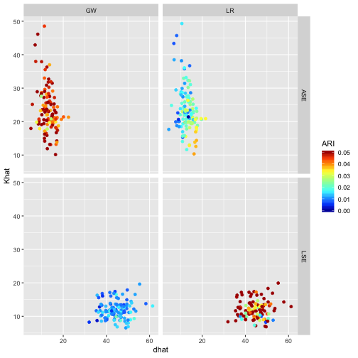
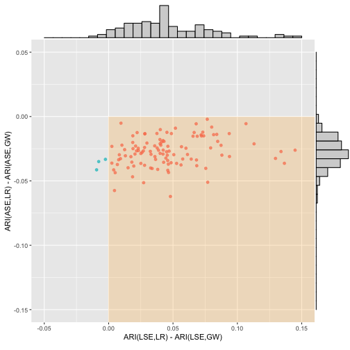

```{r setup, include=FALSE, results='asis'}
suppressMessages(library(knitr))
#suppressMessages(library(kableExtra))
#suppressMessages(library(captioner))
#tab_nums <- captioner(prefix="Table")
#fig_nums <- captioner()

suppressMessages(library(tidyverse))

knitr::opts_chunk$set(echo=TRUE, eval=FALSE,warning=FALSE, message=FALSE)

#x <- rmarkdown::render("README.Rmd", run_pandoc = FALSE, clean = FALSE)
#knit_meta <- attr(x, "knit_meta") 
#rmarkdown::render(input = 'README.md', knit_meta = knit_meta )

# #Determine the output format of the document
# outputFormat   = opts_knit$get("rmarkdown.pandoc.to")
# 
# #Figure and Table Caption Numbering, for HTML do it manually
# capTabNo = 1; capFigNo = 1;
# 
# #Function to add the Table Number
# capTab = function(x){
#   if(outputFormat == 'html'){
#     x = paste0("Table ",capTabNo,". ",x)
#     capTabNo <<- capTabNo + 1
#   }; x
# }
# 
# #Function to add the Figure Number
# capFig = function(x){
#   if(outputFormat == 'html'){
#     x = paste0("Figure ",capFigNo,". ",x)
#     capFigNo <<- capFigNo + 1
#   }; x
# }

#opts_knit$set(aliases=c(h='fig.height', w='fig.width', cap='fig.cap', scap='fig.scap'))                                                                               
#opts_knit$set(eval.after = c('fig.cap','fig.scap'))                                                                            
#knit_hooks$set(document = function(x) {                                                      #          gsub('(\\\\end\\{knitrout\\}[\n]+)', '\\1\\\\noindent ', x)                        #          })

```

-----

<!-- <H1><b>On a 'Two Truths' Phenomenon in Spectral Graph Clustering</b></H1> -->

> Carey E. Priebe, Youngser Park, Joshua T. Vogelstein, John M. Conroy, Vince Lyzinskic, Minh Tang, Avanti Athreya, Joshua Cape, and Eric Bridgeford, "[On a 'Two Truths' Phenomenon in Spectral Graph Clustering](http://arxiv.org/abs/1808.07801)," _Proceedings of National Academy of Science_, submitted, 2018.


# Abstract

Clustering is concerned with coherently grouping observations without any explicit concept of true groupings. Spectral graph clustering -- clustering the vertices of a graph based on their spectral embedding -- is commonly approached via K-means (or, more generally, Gaussian mixture model) clustering composed with either Laplacian or Adjacency spectral embedding (LSE or ASE).
Recent theoretical results provide new understanding of the problem and solutions, and lead us to a 'Two Truths' LSE vs. ASE spectral graph clustering phenomenon
convincingly illustrated here via a diffusion MRI connectome data set:
 the different embedding methods yield different clustering results,
 with LSE capturing left hemisphere/right hemisphere affinity structure
 and ASE capturing gray matter/white matter core-periphery structure.
 
> **Keywords**: Spectral Embedding, Spectral Clustering, Graph, Network, Connectome

```{r, echo=FALSE, eval=TRUE, fig.cap="Figure 1. A 'Two Truths' graph (connectome) depicting connectivity structure such that one grouping of the vertices yields affinity structure (e.g. left hemisphere/right hemisphere) and the other grouping yields core-periphery structure (e.g. gray matter/white matter). Top center: the graph with four vertex colors. Top left / top right: LSE groups one way; ASE groups another way. Bottom left: the LSE truth is two densely connected groups, with sparse interconnectivity between them (affinity structure). Bottom right: the ASE truth is one densely connected group, with sparse interconnectivity between it and the other group and sparse interconnectivity within the other group (core-periphery structure). This paper demonstrates the 'Two Truths' phenomenon illustrated in this figure - that LSE and ASE find fundamentally different but equally meaningful network structure - via theory, simulation, and real data analysis."}
knitr::include_graphics("vignettes/killerfig-cep-g1.jpg")
```

# Supplemental Information (SI)

## Data

Here we make available the connectome data used in our paper:
114 graphs, and for each graph every vertex has a {Left,Right} label and a {Gray,White} label.

NB:
This is not meant to be a finding of neurscientific significance; 
rather, this is an illustration of our ‘Two Truths’ phenomenon. 
As such, we consider binarized versions of the largest connected component of the graphs.
(The original diffusion MRI connectomes are symmetric, hollow, and weighted.)

The $m=114$ adjacency matrices on $n \approx 40,000$ vertices
and associated vertex label attributes
can be downloaded as an R object.  NB: 8GB!

```{r, echo=TRUE, eval=FALSE}
print(load(url("http://www.cis.jhu.edu/~parky/TT/Data/TT-glist114-binary.rda"))) 
# ~8GB, may take several minutes to load.
# This may fail with "Error: vector memory exhaused (limit reached?)" if there is not enough memory on your computer!
#[1] "glist"
length(glist)
#[1] 114

library(igraph)
summary(glist[[1]])
#IGRAPH b40d5fe UNW- 40813 2224492 -- sub-0025864_ses-1_dwi_DS72784
#+ attr: name (g/c), name (v/c), hemisphere (v/c), tissue (v/c), Y
#| (v/c), weight (e/n)

table(V(glist[[1]])$hemisphere)
# left right 
#20412 20401 

table(V(glist[[1]])$tissue)
# gray white 
#19353 21460 

table(V(glist[[1]])$Y)
#   LG    LW    RG    RW 
# 9664 10748  9689 10712 
```

```{r figS0, echo=FALSE, eval=FALSE, fig.show='hold', fig.width=9, fig.height=4.5, fig.cap="Figure S1. Summary of data: number of vertices per graph by hemisphere/tissue type."}
library(TwoTruth)
data(twotruth)

## fix the factor levels for "graph"
twotruth$graph <- as.integer(as.character(twotruth$graph))
twotruth$graph <- sprintf("%02d", twotruth$graph)
twotruth %>% dplyr::select(c(2:8)) #%>%
# kable("html", escape=F, digits=2, align = "c", caption="Table S1. Summary of data: number of vertices per graph by hemisphere/tissue type.") %>%
# 	  kable_styling("striped", full_width = F) %>%
# 	  column_spec(1, bold = T) %>%
# 	  collapse_rows(columns = c(1:7)) %>%  #add_header_above(c(" " = 3, "scan 1" = 5, "scan 2" = 5)) %>%
# 	  scroll_box(width = "600px", height = "500px")

new.dd <- twotruth %>% dplyr::select(c(2:8)) %>% dplyr::select(-3) %>% gather(`n.LG`:`n.RW`, key="class", value="count") %>% unique()
#new.dd$graph <- factor(new.dd$graph, levels = order(levels(new.dd$graph)))
#new.dd$graph <- factor(new.dd$graph, levels=paste(sort(as.integer(levels(new.dd$graph)))))
#new.dd$graph <- factor(new.dd$graph, levels=paste(levels(new.dd$graph)))
new.dd$count <- as.integer(new.dd$count)
#new.dd <- new.dd %>% mutate(index=factor(paste(graph,scan)))
new.dd <- new.dd %>% mutate(index=factor(paste(graph,scan)))
levels(new.dd$index) <- order(levels(new.dd$index))
#levels(new.dd$index) <- as.character(1:length(levels(new.dd$index)))
p1 <- ggplot(new.dd, aes(x=index, y=count, fill=class)) +
	geom_bar(stat="identity") + #facet_grid(~scan) + 
	theme(axis.text.x = element_text(angle = 90, hjust = 1), legend.position = "bottom") +
	theme(legend.title=element_blank()) +
	scale_x_discrete(breaks=as.character(seq(5,max(as.numeric(new.dd$index)),by=5)))
#print(p1)
p2 <- new.dd %>% filter(count>3000) %>%
	ggplot(aes(x=class, y=count, fill=class)) + 
    geom_point(aes(col=class), alpha=0.5, position = position_jitterdodge(jitter.width=0.3)) +
	geom_boxplot(alpha=0.7, notch=TRUE, outlier.size = 0) +
	theme(legend.title=element_blank(), legend.position = "bottom")
#print(p2)
require(egg)
ggarrange(p1,p2, widths=c(1,1))
```
```{r figS02, echo=FALSE, eval=TRUE, fig.show='hold', fig.width=9, fig.height=4.5, fig.cap="Figure S1. Summary of data: number of vertices per graph by hemisphere/tissue type."}
knitr::include_graphics("figure/figS0-12.png")
```

Note that there is one bad graph in the data set: 
image processing failed for left hemisphere of subject 50 scan 2. 
(This anomaly is shown in the bar plot, not shown in the box plot.)
We have left this graph in, as is.


## Code

`R` code for the reproducing the experiemntal results presented in the manuscript is available in the `demo` folder at [github](https://github.com/youngser/TwoTruth).

```{r echo=TRUE}
require(devtools)
devtools::install_github("youngser/TwoTruth")
# WARNING: This may take a while to install all the required packages!
# Also, depending on the enviroment, many packages need to be reinstalled/updated manually!
```

## Figures

```{r demo, eval=FALSE}
library(TwoTruth)
```

```{r figS2, echo=FALSE, eval=TRUE, fig.width=6, fig.height=5, fig.cap="Figure S2. Spectral embedding dimension $\\widehat{d}$ via Zhu & Ghodsi for our 114 connectomes."}
knitr::include_graphics("figure/figS1-1.png")
#source("demo/doFigS1.R")
```
```{r figS3, echo=FALSE, eval=TRUE, fig.width=6, fig.height=5, fig.cap="Figure S3. Number of clusters $\\widehat{K}$ via Mclust BIC for our 114 connectomes."}
knitr::include_graphics("figure/figS2-1.png")
#source("demo/doFigS2.R")
```

```{r fig6, echo=FALSE, eval=TRUE, fig.cap="Figure 6. Results of the ($\\widehat{d},\\widehat{K}$) model selection for spectral graph clustering for each of our 114 connectomes. For LSE we see $\\widehat{d} \\in \\{30,\\dots,60\\}$ and $\\widehat{K} \\in \\{2,\\dots,20\\}$; for ASE we see $\\widehat{d} \\in \\{2,\\dots,20\\}$ and $\\widehat{K} \\in \\{10,\\dots,50\\}$. The color-coding represents clustering performance in terms of ARI for each of LSE and ASE against each of the two truths \\{Left,Right\\} and \\{Gray,White\\}, and shows that LSE clustering identifies $\\{\\mbox{Left},\\mbox{Right}\\}$ better than $\\{\\mbox{Gray},\\mbox{White}\\}$ and ASE identifies $\\{\\mbox{Gray},\\mbox{White}\\}$ better than $\\{\\mbox{Left},\\mbox{Right}\\}$. Our \'Two Truths\' phenomenon is conclusively demonstrated: LSE finds $\\{\\mbox{Left},\\mbox{Right}\\}$ (affinity) while ASE finds $\\{\\mbox{Gray},\\mbox{White}\\}$ (core-periphery)."}

#source("demo/doFig6.R")
```
```{r fig7, echo=FALSE, eval=TRUE, fig.cap="Figure 7. Spectral graph clustering assessment via ARI. For each of our 114 connectomes, we plot the difference in ARI for the $\\{\\mbox{Left},\\mbox{Right}\\}$ truth against the difference in ARI for the $\\{\\mbox{Gray},\\mbox{White}\\}$ truth for the clusterings produced by each of LSE and ASE: x = ARI(LSE,LR) $-$ ARI(LSE,GW) vs. y = ARI(ASE,LR) $-$ ARI(ASE,GW). A point in the $(+,-)$ quadrant indicates that for that connectome the LSE clustering identified $\\{\\mbox{Left},\\mbox{Right}\\}$ better than $\\{\\mbox{Gray},\\mbox{White}\\}$ and ASE identified $\\{\\mbox{Gray},\\mbox{White}\\}$ better than $\\{\\mbox{Left},\\mbox{Right}\\}$. Marginal histograms are provided. Our 'Two Truths' phenomenon is conclusively demonstrated: LSE identifies $\\{\\mbox{Left},\\mbox{Right}\\}$ (affinity) while ASE identifies $\\{\\mbox{Gray},\\mbox{White}\\}$ (core-periphery)."}

#source("demo/doFig7.R")
```

Generating figures from pre-calculated spectral clustering results:

* Figure S2 (spectral embedding dimension $\widehat{d}$ via Zhu \& Ghodsi): `demo(doFigS1)`    
* Figure S3 (number of clusters $\widehat{K}$ via Mclust BIC):  `demo(doFigS2)`   
* Figure 6 ($\widehat{d}$, $\widehat{K}$, and ARI against {Left, Right} and against {Gray, White}): `demo(doFig6)`  
* Figure 7 (ARI comparison demonstrating the 'Two Truths' phenomenon): `demo(doFig7)` 

## One Graph

Generating spectral clustering results from the data may take tens of hours.  
Here is an example to run our spectral clustering on one graph:

```{r oneg, echo=TRUE, eval=FALSE}
library(TwoTruth)
library(igraph)
library(tidyverse)

load(url("http://www.cis.jhu.edu/~parky/TT/Data/g-s1s1.Rbin"))
summary(g)
#IGRAPH aa0dcd3 UNW- 40813 2224492 -- sub-0025864_ses-1_dwi_DS72784
#+ attr: name (g/c), name (v/c), hemisphere (v/c), tissue (v/c), Y (v/c), weight (e/n)

# Embed into 'optimal' dimension and cluster into 'optimal' number of groups
out.ase <- sclust(g, embed="ASE", dmax=100, Kmax=50, clustering="mclust")
out.lse <- sclust(g, embed="LSE", dmax=100, Kmax=50, clustering="mclust") 
```
```{r oneg2, echo=FALSE, eval=TRUE}
# Embed into 2-dimension and cluster into 2 groups
#out.ase2 <- sclust(g, embed="ASE", dmax=2, elb=2, Kmax=2, clustering="mclust")
#out.lse2 <- sclust(g, embed="LSE", dmax=2, elb=2, Kmax=2, clustering="mclust") 
# WARNING: Each run takes  <= 30 min in our linux server

# Embed into 4-dimension and cluster into 4 groups
#out.ase4 <- sclust(g, embed="ASE", dmax=4, elb=4, Kmax=4:4, clustering="mclust")
#out.lse4 <- sclust(g, embed="LSE", dmax=4, elb=4, Kmax=4:4, clustering="mclust") 

load("~/Dropbox/MRC/out-sclust-ase-lse-dhat2-s1s1.Rbin")
#out.ase2 <- out.ase; out.lse4 <- out.lse
#load("~/Dropbox/MRC/out-sclust-ase-lse-dhat4-s1s1.Rbin")
#out.ase4 <- out.ase; out.lse4 <- out.lse
#[3,] "ASE" 4    4    0    0.07
#[4,] "LSE" 4    4    0.01 0   
load("~/Dropbox/MRC/out-sclust-ase-lse-s1s1.Rbin")
#out <- rbind(c(embed="ASE", round(out.ase2$mout$df[,-5],2)), 
#             c(embed="LSE", round(out.lse2$mout$df[,-5],2)),
#             c(embed="ASE", round(out.ase$mout$df[,-5],2)),
#             c(embed="LSE", round(out.lse$mout$df[,-5],2)))
```
```{r oneg3, echo=TRUE, eval=TRUE}
df <- data.frame(embed=c("ASE","LSE"), round(rbind(out.ase$mout$df[,-5], 
                                                   out.lse$mout$df[,-5]),2))
df
```
```{r oneg4, echo=FALSE, eval=FALSE, tidy=FALSE}
df <- data.frame(embed=c("ASE","LSE"), rbind(out.ase$mout$df[,-5], 
                                             out.lse$mout$df[,-5]))
#options(knitr.table.format = "html") 
df %>% mutate(
    LR = cell_spec(round(LR,2), "html", color=ifelse(LR==max(LR), "red", "black")),
    GW = cell_spec(round(GW,2), "html", color=ifelse(GW==max(GW), "red", "black"))) %>%
  kable(format = "html", escape = F, digits = 2, align = "c", booktabs=TRUE) %>%
  kable_styling("striped", full_width = F) %>%
  column_spec(1, bold = T) #%>%
```

With the ARI null distribution (via permutations):

```{r null, echo=FALSE, eval=TRUE, fig.align='center'}
suppressMessages(require(igraph))
suppressMessages(require(mclust))
set.seed(12345)
ari.LR.ase0 <- sapply(1:100, function(x) adjustedRandIndex(sample(V(out.ase$g)$hemisphere),
                                                           out.ase$mout$mout$class))
ari.GW.ase0 <- sapply(1:100, function(x) adjustedRandIndex(sample(V(out.ase$g)$tissue),
                                                           out.ase$mout$mout$class))
ari.LR.lse0 <- sapply(1:100, function(x) adjustedRandIndex(sample(V(out.lse$g)$hemisphere),
                                                           out.lse$mout$mout$class))
ari.GW.lse0 <- sapply(1:100, function(x) adjustedRandIndex(sample(V(out.lse$g)$tissue),
                                                           out.lse$mout$mout$class))
df.ase.null <- data.frame(embed="ASE", LR=ari.LR.ase0, GW=ari.GW.ase0)
df.lse.null <- data.frame(embed="LSE", LR=ari.LR.ase0, GW=ari.GW.ase0)
df2 <- rbind(df.ase.null, df.lse.null)
df2 <- gather(df2, `LR`:`GW`, key="key", value="value")
dfA <- gather(df[,-c(2,3)], `LR`:`GW`, key="key", value="value")
#df4 <- rbind(cbind(df2, stat="null"), cbind(df3, stat="alt"))
ggplot(df2, aes(x=value, y=..scaled.., fill = key, colour = key)) +
    geom_density(aes(linetype="solid"), alpha = 0.2) + #scale_y_continuous(trans='log10') +
    facet_grid(embed~.) + labs(x="ARI", y="scaled density") +
    geom_vline(data=dfA, aes(xintercept = value, color=key, linetype="dashed"), size=0.7) +
    scale_linetype_manual(name="stat", values = c("dashed" = 2, "solid" = 1), labels = c("alt", "null"))
```

```{r anyk, eval=FALSE, echo=FALSE}
#can you do this null for all K = 1,2,...,50?

n <- vcount(out.ase$g)
set.seed(12345)
df0.k <- NULL
for (k in 1:50) {
    df0 <- NULL
    for (mc in 1:100) {
        if (k==1) {
            Yhat <- rep(k, n)
        } else {
            Yhat <- sample(sample(n,k), n, rep=TRUE)
        }
        ari.LR0 <- adjustedRandIndex(Yhat, V(out.ase$g)$hemisphere)
        ari.GW0 <- adjustedRandIndex(Yhat, V(out.ase$g)$tissue)
        df0[[mc]] <- data.frame(K=k, LR=ari.LR0, GW=ari.GW0)
    }
    df0.k[[k]] <- Reduce('rbind', df0)
}
df0K <- Reduce('rbind', df0.k)
save(df0K, file="df0K.Rbin")
```
```{r allk, echo=FALSE, eval=FALSE}
load("df0K.Rbin")
df2 <- gather(df0K, `LR`:`GW`, key="key", value="value")
dfA <- gather(df[,-c(2,3)], `LR`:`GW`, key="key", value="value")
#df4 <- rbind(cbind(df2, stat="null"), cbind(df3, stat="alt"))
ggplot(df2, aes(x=value, y=..density.., fill = factor(K), colour = factor(K))) +
    geom_density(alpha = 0.1) + #scale_y_continuous(trans='log10') +
    facet_grid(key~., scales='free') + labs(x="ARI", y="density") #+
#    geom_vline(data=dfA, aes(xintercept = value, linetype="dashed"), size=0.7) #+
#    scale_linetype_manual(name="stat", values = c("dashed" = 2, "solid" = 1), labels = c("alt", "null"))

ggplot(df2, aes(x=value, y=..scaled.., fill = factor(K), colour = factor(K))) +
    geom_density(aes(linetype=key), alpha = 0.1) + #scale_y_continuous(trans='log10') +
#    facet_wrap(embed~., scales='free', nrow=2) + 
    labs(x="ARI", y="scaled density") #+

```

## Simulation

To run a simple simulation using the synthetic data based on the real 4 x 4 `B` matrix, please do

```{r sim, eval=FALSE}
demo(simulation)
```

# Software and Hardware Information

```{r vn,echo=TRUE, eval=FALSE}
sessionInfo()

R version 3.4.2 (2017-09-28)
Platform: x86_64-apple-darwin15.6.0 (64-bit)
Running under: macOS High Sierra 10.13.5

Matrix products: default
BLAS: /System/Library/Frameworks/Accelerate.framework/Versions/A/Frameworks/vecLib.framework/Versions/A/libBLAS.dylib
LAPACK: /Library/Frameworks/R.framework/Versions/3.4/Resources/lib/libRlapack.dylib

locale:
[1] en_US.UTF-8/en_US.UTF-8/en_US.UTF-8/C/en_US.UTF-8/en_US.UTF-8

attached base packages:
[1] stats     graphics  grDevices utils     datasets  methods   base     

other attached packages:
[1] TwoTruth_0.1.0

loaded via a namespace (and not attached):
 [1] Rcpp_0.12.18    bookdown_0.7    digest_0.6.15   rprojroot_1.3-2 backports_1.1.2 magrittr_1.5   
 [7] evaluate_0.10.1 stringi_1.2.3   rmarkdown_1.10  tools_3.4.2     stringr_1.3.1   xfun_0.3       
[13] yaml_2.1.19     rsconnect_0.8   compiler_3.4.2  htmltools_0.3.6 knitr_1.20     
```

-----
Carey E Priebe & Youngser Park  
Department of Applied Mathematics and Statistics  
Johns Hopkins University  
 
*prepared by <youngser@jhu.edu> on `r date()`*
