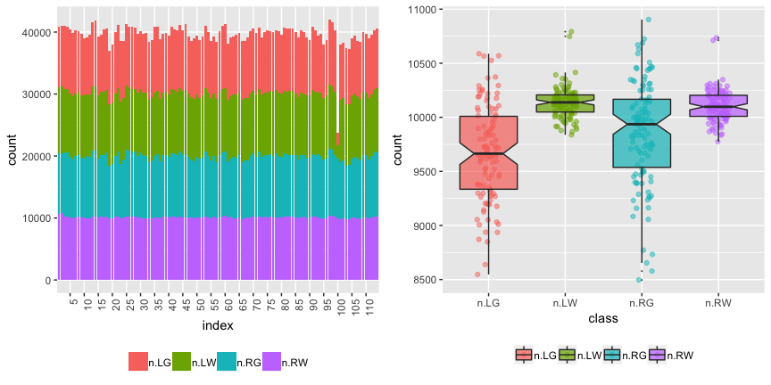
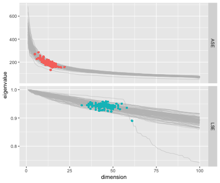
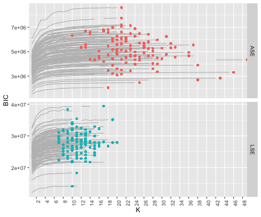
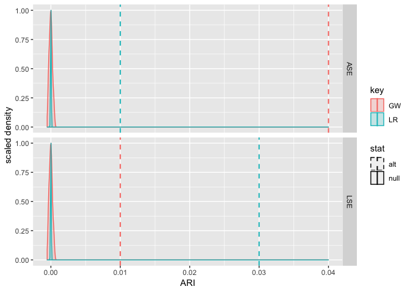

-   [Abstract](#abstract)
-   [Supplemental Information (SI)](#supplemental-information-si)
    -   [Data](#data)
    -   [Code](#code)
    -   [Figures](#figures)
    -   [One Graph](#one-graph)
    -   [Simulation](#simulation)
-   [Software and Hardware
    Information](#software-and-hardware-information)

------------------------------------------------------------------------

<!-- <H1><b>On a 'Two Truths' Phenomenon in Spectral Graph Clustering</b></H1> -->
> Carey E. Priebe, Youngser Park, Joshua T. Vogelstein, John M. Conroy,
> Vince Lyzinskic, Minh Tang, Avanti Athreya, Joshua Cape, and Eric
> Bridgeford, “[On a ‘Two Truths’ Phenomenon in Spectral Graph
> Clustering](http://arxiv.org/abs/1808.07801),” *Proceedings of
> National Academy of Science*, submitted, 2018.

Abstract
========

Clustering is concerned with coherently grouping observations without
any explicit concept of true groupings. Spectral graph clustering –
clustering the vertices of a graph based on their spectral embedding –
is commonly approached via K-means (or, more generally, Gaussian mixture
model) clustering composed with either Laplacian or Adjacency spectral
embedding (LSE or ASE). Recent theoretical results provide new
understanding of the problem and solutions, and lead us to a ‘Two
Truths’ LSE vs. ASE spectral graph clustering phenomenon convincingly
illustrated here via a diffusion MRI connectome data set: the different
embedding methods yield different clustering results, with LSE capturing
left hemisphere/right hemisphere affinity structure and ASE capturing
gray matter/white matter core-periphery structure.

> **Keywords**: Spectral Embedding, Spectral Clustering, Graph, Network,
> Connectome

**Figure 1.** A ‘Two Truths’ graph (connectome) depicting connectivity
structure such that one grouping of the vertices yields affinity
structure (e.g. left hemisphere/right hemisphere) and the other grouping
yields core-periphery structure (e.g. gray matter/white matter). Top
center: the graph with four vertex colors. Top left / top right: LSE
groups one way; ASE groups another way. Bottom left: the LSE truth is
two densely connected groups, with sparse interconnectivity between them
(affinity structure). Bottom right: the ASE truth is one densely
connected group, with sparse interconnectivity between it and the other
group and sparse interconnectivity within the other group
(core-periphery structure). This paper demonstrates the ‘Two Truths’
phenomenon illustrated in this figure - that LSE and ASE find
fundamentally different but equally meaningful network structure - via
theory, simulation, and real data analysis.

Supplemental Information (SI)
=============================

Data
----

Here we make available the connectome data used in our paper: 114
graphs, and for each graph every vertex has a {Left,Right} label and a
{Gray,White} label.

NB: This is not meant to be a finding of neurscientific significance;
rather, this is an illustration of our ‘Two Truths’ phenomenon. As such,
we consider binarized versions of the largest connected component of the
graphs. (The original diffusion MRI connectomes are symmetric, hollow,
and weighted.)

The *m* = 114 adjacency matrices on *n* ≈ 40, 000 vertices and
associated vertex label attributes can be downloaded as an R object. NB:
8GB!

    print(load(url("http://www.cis.jhu.edu/~parky/TT/Data/TT-glist114-binary.rda"))) 
    # ~8GB, may take several minutes to load.
    # This may fail with "Error: vector memory exhaused (limit reached?)" if there is not enough memory on your computer!
    #[1] "glist"
    length(glist)
    #[1] 114

    library(igraph)
    summary(glist[[1]])
    #IGRAPH b40d5fe UNW- 40813 2224492 -- sub-0025864_ses-1_dwi_DS72784
    #+ attr: name (g/c), name (v/c), hemisphere (v/c), tissue (v/c), Y
    #| (v/c), weight (e/n)

    table(V(glist[[1]])$hemisphere)
    # left right 
    #20412 20401 

    table(V(glist[[1]])$tissue)
    # gray white 
    #19353 21460 

    table(V(glist[[1]])$Y)
    #   LG    LW    RG    RW 
    # 9664 10748  9689 10712 

**Figure S1.** Summary of data: number of vertices per graph by
hemisphere/tissue type.

Note that there is one bad graph in the data set: image processing
failed for left hemisphere of subject 50 scan 2. (This anomaly is shown
in the bar plot, not shown in the box plot.) We have left this graph in,
as is.

Code
----

`R` code for the reproducing the experiemntal results presented in the
manuscript is available in the `demo` folder at
[github](https://github.com/youngser/TwoTruth).

    require(devtools)
    devtools::install_github("youngser/TwoTruth")
    # WARNING: This may take a while to install all the required packages!
    # Also, depending on the enviroment, many packages need to be reinstalled/updated manually!

Figures
-------

    library(TwoTruth)

**Figure S2.** Spectral embedding dimension *d̂* via Zhu & Ghodsi for our
114 connectomes.

**Figure S3.** Number of clusters *K̂* via Mclust BIC for our 114
connectomes.

**Figure 6.** Results of the (*d̂*, *K̂*) model selection for spectral
graph clustering for each of our 114 connectomes. For LSE we see
*d̂* ∈ {30, …, 60} and *K̂* ∈ {2, …, 20}; for ASE we see *d̂* ∈ {2, …, 20}
and *K̂* ∈ {10, …, 50}. The color-coding represents clustering
performance in terms of ARI for each of LSE and ASE against each of the
two truths {Left,Right} and {Gray,White}, and shows that LSE clustering
identifies {Left, Right} better than {Gray, White} and ASE identifies
{Gray, White} better than {Left, Right}. Our ‘Two Truths’ phenomenon is
conclusively demonstrated: LSE finds {Left, Right} (affinity) while ASE
finds {Gray, White} (core-periphery).

**Figure 7.** Spectral graph clustering assessment via ARI. For each of
our 114 connectomes, we plot the difference in ARI for the {Left, Right}
truth against the difference in ARI for the {Gray, White} truth for the
clusterings produced by each of LSE and ASE: *x* = ARI(LSE,LR) −
ARI(LSE,GW) vs. *y* = ARI(ASE,LR) − ARI(ASE,GW). A point in the (+, − )
quadrant indicates that for that connectome the LSE clustering
identified {Left, Right} better than {Gray, White} and ASE identified
{Gray, White} better than {Left, Right}. Marginal histograms are
provided. Our ‘Two Truths’ phenomenon is conclusively demonstrated: LSE
identifies {Left, Right} (affinity) while ASE identifies {Gray, White}
(core-periphery).

Generating figures from pre-calculated spectral clustering results:

-   Figure S2 (spectral embedding dimension *d̂* via Zhu & Ghodsi):
    `demo(doFigS1)`  
-   Figure S3 (number of clusters *K̂* via Mclust BIC): `demo(doFigS2)`  
-   Figure 6 (*d̂*, *K̂*, and ARI against {Left, Right} and against {Gray,
    White}): `demo(doFig6)`  
-   Figure 7 (ARI comparison demonstrating the ‘Two Truths’ phenomenon):
    `demo(doFig7)`

One Graph
---------

Generating spectral clustering results from the data may take tens of
hours.  
Here is an example to run our spectral clustering on one graph:

    library(TwoTruth)
    library(igraph)
    library(tidyverse)

    load(url("http://www.cis.jhu.edu/~parky/TT/Data/g-s1s1.Rbin"))
    summary(g)
    #IGRAPH aa0dcd3 UNW- 40813 2224492 -- sub-0025864_ses-1_dwi_DS72784
    #+ attr: name (g/c), name (v/c), hemisphere (v/c), tissue (v/c), Y (v/c), weight (e/n)

    # Embed into 'optimal' dimension and cluster into 'optimal' number of groups
    out.ase <- sclust(g, embed="ASE", dmax=100, Kmax=50, clustering="mclust")
    out.lse <- sclust(g, embed="LSE", dmax=100, Kmax=50, clustering="mclust") 

    df <- data.frame(embed=c("ASE","LSE"), round(rbind(out.ase$mout$df[,-5], 
                                                       out.lse$mout$df[,-5]),2))
    df

With the ARI null distribution (via permutations):

Simulation
----------

To run a simple simulation using the synthetic data based on the real 4
x 4 `B` matrix, please do

    demo(simulation)

Software and Hardware Information
=================================

    sessionInfo()

    R version 3.4.2 (2017-09-28)
    Platform: x86_64-apple-darwin15.6.0 (64-bit)
    Running under: macOS High Sierra 10.13.5

    Matrix products: default
    BLAS: /System/Library/Frameworks/Accelerate.framework/Versions/A/Frameworks/vecLib.framework/Versions/A/libBLAS.dylib
    LAPACK: /Library/Frameworks/R.framework/Versions/3.4/Resources/lib/libRlapack.dylib

    locale:
    [1] en_US.UTF-8/en_US.UTF-8/en_US.UTF-8/C/en_US.UTF-8/en_US.UTF-8

    attached base packages:
    [1] stats     graphics  grDevices utils     datasets  methods   base     

    other attached packages:
    [1] TwoTruth_0.1.0

    loaded via a namespace (and not attached):
     [1] Rcpp_0.12.18    bookdown_0.7    digest_0.6.15   rprojroot_1.3-2 backports_1.1.2 magrittr_1.5   
     [7] evaluate_0.10.1 stringi_1.2.3   rmarkdown_1.10  tools_3.4.2     stringr_1.3.1   xfun_0.3       
    [13] yaml_2.1.19     rsconnect_0.8   compiler_3.4.2  htmltools_0.3.6 knitr_1.20     

------------------------------------------------------------------------

Carey E Priebe & Youngser Park  
Department of Applied Mathematics and Statistics  
Johns Hopkins University

*prepared by <youngser@jhu.edu> on Thu Nov 1 09:46:47 2018*
