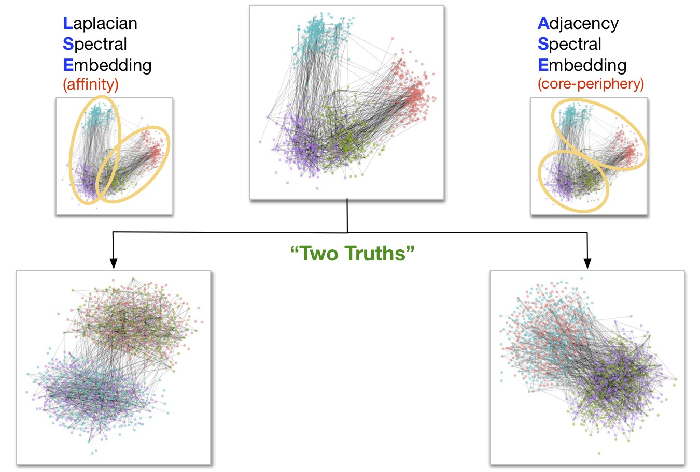

**[Department of Applied Mathematics and Statistics](http://engineering.jhu.edu/ams/)**      
**[Center for Imaging Science](http://www.cis.jhu.edu)**  
**[Department of Biomedical Engineering](http://engineering.jhu.edu/bme/)**      
**[Human Language Technology Center of Excellence](http://hltcoe.jhu.edu)**  
**[Johns Hopkins University](http://www.jhu.edu)**  
and  
**[University of Massachusetts, Amherst, MA](http://umass.edu)**  
and  
**[Institute for Defense Analyses, Center for Computing Science]()**  

-----

> Carey E. Priebe, Youngser Park, Joshua T. Vogelstein, John M. Conroy, Vince Lyzinskic, Minh Tang, Avanti Athreya, Joshua Cape, and Eric Bridgeford, "[On a 'Two Truths' Phenomenon in Spectral Graph Clustering](http://arxiv.org/abs/xxxx)," _Proceedings of National Academy of Science_, submitted, 2018.


# Abstract

Clustering is concerned with coherently grouping observations without any explicit concept of true groupings. Spectral graph clustering -- clustering the vertices of a graph based on their spectral embedding -- is commonly approached via K-means (or, more generally, Gaussian mixture model) clustering composed with either Laplacian or Adjacency spectral embedding (LSE or ASE).
Recent theoretical results provide new understanding of the problem and solutions, and lead us to a 'Two Truths' LSE vs. ASE spectral graph clustering phenomenon
convincingly illustrated here via a diffusion MRI connectome data set:
 the different embedding methods yield different clustering results,
 with LSE capturing left hemisphere/right hemisphere affinity structure
 and ASE capturing gray matter/white matter core-periphery structure.
 
> **Keywords**: Spectral Embedding, Spectral Clustering, Graph, Network, Connectome

<figure>

  <figcaption>Illustration of the `Two Truth` graph.</figcaption>
</figure>


# Codes and Demos

To run the experiemnts in the paper, please follow these steps.  
(NB: All the codes are in the `demo` folder at [github](https://github.com/youngser/TwoTruth).)

## `R` Package

The latest `R` source package can be installed via `github` as


```r
require(devtools)
devtools::install_github("youngser/TwoTruth")
```

## Demos

To reproduce most of the Figures and Tables in the manuscript, please follow these steps:


```r
library(TwoTruth)

demo(Fig5)
demo(Fig6) 
demo(Fig7) 
demo(FigSI1) 
demo(FigSI2) 
```

# Software and Hardware Information


```r
library(help='TwoTruth')
sessionInfo()
```

```
## R version 3.4.2 (2017-09-28)
## Platform: x86_64-apple-darwin15.6.0 (64-bit)
## Running under: macOS High Sierra 10.13.5
## 
## Matrix products: default
## BLAS: /Library/Frameworks/R.framework/Versions/3.4/Resources/lib/libRblas.0.dylib
## LAPACK: /Library/Frameworks/R.framework/Versions/3.4/Resources/lib/libRlapack.dylib
## 
## locale:
## [1] en_US.UTF-8/en_US.UTF-8/en_US.UTF-8/C/en_US.UTF-8/en_US.UTF-8
## 
## attached base packages:
## [1] stats     graphics  grDevices utils     datasets  methods   base     
## 
## other attached packages:
## [1] knitr_1.20
## 
## loaded via a namespace (and not attached):
##  [1] compiler_3.4.2  backports_1.1.2 magrittr_1.5    rprojroot_1.3-2
##  [5] tools_3.4.2     htmltools_0.3.6 yaml_2.1.19     Rcpp_0.12.18   
##  [9] stringi_1.2.3   rmarkdown_1.10  stringr_1.3.1   digest_0.6.15  
## [13] evaluate_0.10.1
```

-----
*prepared by <youngser@jhu.edu> on Wed Aug 22 09:02:09 2018*
