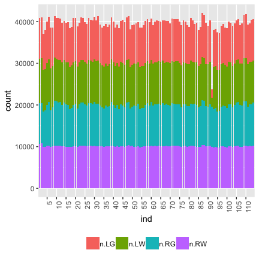
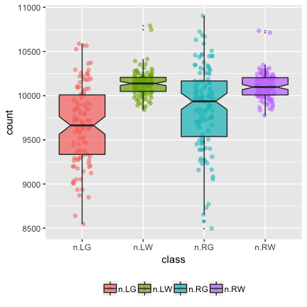
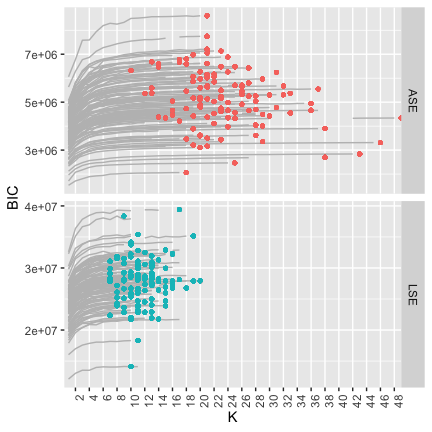

-----

> Carey E. Priebe, Youngser Park, Joshua T. Vogelstein, John M. Conroy, Vince Lyzinskic, Minh Tang, Avanti Athreya, Joshua Cape, and Eric Bridgeford, "[On a 'Two Truths' Phenomenon in Spectral Graph Clustering](http://arxiv.org/abs/1808.07801)," _Proceedings of National Academy of Science_, submitted, 2018.


# Abstract

Clustering is concerned with coherently grouping observations without any explicit concept of true groupings. Spectral graph clustering -- clustering the vertices of a graph based on their spectral embedding -- is commonly approached via K-means (or, more generally, Gaussian mixture model) clustering composed with either Laplacian or Adjacency spectral embedding (LSE or ASE).
Recent theoretical results provide new understanding of the problem and solutions, and lead us to a 'Two Truths' LSE vs. ASE spectral graph clustering phenomenon
convincingly illustrated here via a diffusion MRI connectome data set:
 the different embedding methods yield different clustering results,
 with LSE capturing left hemisphere/right hemisphere affinity structure
 and ASE capturing gray matter/white matter core-periphery structure.
 
> **Keywords**: Spectral Embedding, Spectral Clustering, Graph, Network, Connectome

<figure>

  <figcaption>Figure 1. A 'Two Truths' graph (connectome) depicting connectivity structure such that one grouping of the vertices yields affinity structure (e.g. left hemisphere/right hemisphere) and the other grouping yields core-periphery structure (e.g. gray matter/white matter). Top center: the graph with four vertex colors. Top left / top right: LSE groups one way; ASE groups another way. Bottom left: the LSE truth is two densely connected groups, with sparse interconnectivity between them (affinity structure). Bottom right: the ASE truth is one densely connected group, with sparse interconnectivity between it and the other group and sparse interconnectivity within the other group (core-periphery structure). This paper demonstrates the 'Two Truths' phenomenon illustrated in this figure - that LSE and ASE find fundamentally different but equally meaningful network structure - via theory, simulation, and real data analysis.</figcaption>
</figure>


# Supplemental Information (SI)

## Data

Here we make available the connectome data used in our paper:
114 graphs, and for each graph every vertex has a {Left,Right} label and a {Gray,White} label.

NB:
This is not meant to be a finding of neurscientific significance; 
rather, this is an illustration of our ‘Two Truths’ phenomenon. 
As such, we consider binarized versions of the largest connected component of the graphs.
(The original diffusion MRI connectomes are symmetric, hollow, and weighted.)

The $m=114$ adjacency matrices on $n \approx 40,000$ vertices
and associated vertex label attributes
can be downloaded as an R object.  NB: 8GB!


```r
print(load(url("http://www.cis.jhu.edu/~parky/TT/Data/TT-glist114-binary.rda"))) 
# ~8GB, may take several minutes to load.
# This may fail with "Error: vector memory exhaused (limit reached?)" if there is not enough memory on your computer!
#[1] "glist"
length(glist)
#[1] 114

library(igraph)
summary(glist[[1]])
#IGRAPH b40d5fe UNW- 40813 2224492 -- sub-0025864_ses-1_dwi_DS72784
#+ attr: name (g/c), name (v/c), hemisphere (v/c), tissue (v/c), Y
#| (v/c), weight (e/n)

table(V(glist[[1]])$hemisphere)
# left right 
#20412 20401 

table(V(glist[[1]])$tissue)
# gray white 
#19353 21460 

table(V(glist[[1]])$Y)
#   LG    LW    RG    RW 
# 9664 10748  9689 10712 
```

<div style="border: 1px solid #ddd; padding: 5px; overflow-y: scroll; height:500px; overflow-x: scroll; width:600px; "><table class="table table-striped" style="width: auto !important; margin-left: auto; margin-right: auto;">
<caption>(\#tab:unnamed-chunk-2)Summary of data: number of vertices per graph by hemisphere/tissue type.</caption>
 <thead>
  <tr>
   <th style="text-align:center;"> graph </th>
   <th style="text-align:center;"> scan </th>
   <th style="text-align:center;"> n </th>
   <th style="text-align:center;"> n.LG </th>
   <th style="text-align:center;"> n.LW </th>
   <th style="text-align:center;"> n.RG </th>
   <th style="text-align:center;"> n.RW </th>
  </tr>
 </thead>
<tbody>
  <tr>
   <td style="text-align:center;font-weight: bold;vertical-align: middle !important;" rowspan="4"> 01 </td>
   <td style="text-align:center;vertical-align: middle !important;" rowspan="2"> scan 1 </td>
   <td style="text-align:center;vertical-align: middle !important;" rowspan="2"> 40813 </td>
   <td style="text-align:center;vertical-align: middle !important;" rowspan="2"> 9664 </td>
   <td style="text-align:center;vertical-align: middle !important;" rowspan="2"> 10748 </td>
   <td style="text-align:center;vertical-align: middle !important;" rowspan="2"> 9689 </td>
   <td style="text-align:center;vertical-align: middle !important;" rowspan="2"> 10712 </td>
  </tr>
  <tr>
   
   
   
   
   
   
   
  </tr>
  <tr>
   
   <td style="text-align:center;vertical-align: middle !important;" rowspan="2"> scan 2 </td>
   <td style="text-align:center;vertical-align: middle !important;" rowspan="2"> 40965 </td>
   <td style="text-align:center;vertical-align: middle !important;" rowspan="2"> 9716 </td>
   <td style="text-align:center;vertical-align: middle !important;" rowspan="2"> 10792 </td>
   <td style="text-align:center;vertical-align: middle !important;" rowspan="2"> 9722 </td>
   <td style="text-align:center;vertical-align: middle !important;" rowspan="2"> 10735 </td>
  </tr>
  <tr>
   
   
   
   
   
   
   
  </tr>
  <tr>
   <td style="text-align:center;font-weight: bold;vertical-align: middle !important;" rowspan="4"> 02 </td>
   <td style="text-align:center;vertical-align: middle !important;" rowspan="2"> scan 1 </td>
   <td style="text-align:center;vertical-align: middle !important;" rowspan="2"> 40975 </td>
   <td style="text-align:center;vertical-align: middle !important;" rowspan="2"> 10177 </td>
   <td style="text-align:center;vertical-align: middle !important;" rowspan="2"> 10250 </td>
   <td style="text-align:center;vertical-align: middle !important;" rowspan="2"> 10342 </td>
   <td style="text-align:center;vertical-align: middle !important;" rowspan="2"> 10206 </td>
  </tr>
  <tr>
   
   
   
   
   
   
   
  </tr>
  <tr>
   
   <td style="text-align:center;vertical-align: middle !important;" rowspan="2"> scan 2 </td>
   <td style="text-align:center;vertical-align: middle !important;" rowspan="2"> 40788 </td>
   <td style="text-align:center;vertical-align: middle !important;" rowspan="2"> 10045 </td>
   <td style="text-align:center;vertical-align: middle !important;" rowspan="2"> 10102 </td>
   <td style="text-align:center;vertical-align: middle !important;" rowspan="2"> 10463 </td>
   <td style="text-align:center;vertical-align: middle !important;" rowspan="2"> 10178 </td>
  </tr>
  <tr>
   
   
   
   
   
   
   
  </tr>
  <tr>
   <td style="text-align:center;font-weight: bold;vertical-align: middle !important;" rowspan="4"> 03 </td>
   <td style="text-align:center;vertical-align: middle !important;" rowspan="2"> scan 1 </td>
   <td style="text-align:center;vertical-align: middle !important;" rowspan="2"> 40421 </td>
   <td style="text-align:center;vertical-align: middle !important;" rowspan="2"> 10294 </td>
   <td style="text-align:center;vertical-align: middle !important;" rowspan="2"> 10210 </td>
   <td style="text-align:center;vertical-align: middle !important;" rowspan="2"> 9805 </td>
   <td style="text-align:center;vertical-align: middle !important;" rowspan="2"> 10112 </td>
  </tr>
  <tr>
   
   
   
   
   
   
   
  </tr>
  <tr>
   
   <td style="text-align:center;vertical-align: middle !important;" rowspan="2"> scan 2 </td>
   <td style="text-align:center;vertical-align: middle !important;" rowspan="2"> 39919 </td>
   <td style="text-align:center;vertical-align: middle !important;" rowspan="2"> 10223 </td>
   <td style="text-align:center;vertical-align: middle !important;" rowspan="2"> 10227 </td>
   <td style="text-align:center;vertical-align: middle !important;" rowspan="2"> 9491 </td>
   <td style="text-align:center;vertical-align: middle !important;" rowspan="2"> 9978 </td>
  </tr>
  <tr>
   
   
   
   
   
   
   
  </tr>
  <tr>
   <td style="text-align:center;font-weight: bold;vertical-align: middle !important;" rowspan="4"> 04 </td>
   <td style="text-align:center;vertical-align: middle !important;" rowspan="2"> scan 1 </td>
   <td style="text-align:center;vertical-align: middle !important;" rowspan="2"> 40268 </td>
   <td style="text-align:center;vertical-align: middle !important;" rowspan="2"> 10192 </td>
   <td style="text-align:center;vertical-align: middle !important;" rowspan="2"> 10110 </td>
   <td style="text-align:center;vertical-align: middle !important;" rowspan="2"> 9831 </td>
   <td style="text-align:center;vertical-align: middle !important;" rowspan="2"> 10135 </td>
  </tr>
  <tr>
   
   
   
   
   
   
   
  </tr>
  <tr>
   
   <td style="text-align:center;vertical-align: middle !important;" rowspan="2"> scan 2 </td>
   <td style="text-align:center;vertical-align: middle !important;" rowspan="2"> 40168 </td>
   <td style="text-align:center;vertical-align: middle !important;" rowspan="2"> 9833 </td>
   <td style="text-align:center;vertical-align: middle !important;" rowspan="2"> 10060 </td>
   <td style="text-align:center;vertical-align: middle !important;" rowspan="2"> 10074 </td>
   <td style="text-align:center;vertical-align: middle !important;" rowspan="2"> 10201 </td>
  </tr>
  <tr>
   
   
   
   
   
   
   
  </tr>
  <tr>
   <td style="text-align:center;font-weight: bold;vertical-align: middle !important;" rowspan="4"> 05 </td>
   <td style="text-align:center;vertical-align: middle !important;" rowspan="2"> scan 1 </td>
   <td style="text-align:center;vertical-align: middle !important;" rowspan="2"> 39710 </td>
   <td style="text-align:center;vertical-align: middle !important;" rowspan="2"> 9866 </td>
   <td style="text-align:center;vertical-align: middle !important;" rowspan="2"> 10171 </td>
   <td style="text-align:center;vertical-align: middle !important;" rowspan="2"> 9603 </td>
   <td style="text-align:center;vertical-align: middle !important;" rowspan="2"> 10070 </td>
  </tr>
  <tr>
   
   
   
   
   
   
   
  </tr>
  <tr>
   
   <td style="text-align:center;vertical-align: middle !important;" rowspan="2"> scan 2 </td>
   <td style="text-align:center;vertical-align: middle !important;" rowspan="2"> 39027 </td>
   <td style="text-align:center;vertical-align: middle !important;" rowspan="2"> 9311 </td>
   <td style="text-align:center;vertical-align: middle !important;" rowspan="2"> 10107 </td>
   <td style="text-align:center;vertical-align: middle !important;" rowspan="2"> 9531 </td>
   <td style="text-align:center;vertical-align: middle !important;" rowspan="2"> 10078 </td>
  </tr>
  <tr>
   
   
   
   
   
   
   
  </tr>
  <tr>
   <td style="text-align:center;font-weight: bold;vertical-align: middle !important;" rowspan="4"> 06 </td>
   <td style="text-align:center;vertical-align: middle !important;" rowspan="2"> scan 1 </td>
   <td style="text-align:center;vertical-align: middle !important;" rowspan="2"> 39072 </td>
   <td style="text-align:center;vertical-align: middle !important;" rowspan="2"> 9125 </td>
   <td style="text-align:center;vertical-align: middle !important;" rowspan="2"> 9945 </td>
   <td style="text-align:center;vertical-align: middle !important;" rowspan="2"> 9994 </td>
   <td style="text-align:center;vertical-align: middle !important;" rowspan="2"> 10008 </td>
  </tr>
  <tr>
   
   
   
   
   
   
   
  </tr>
  <tr>
   
   <td style="text-align:center;vertical-align: middle !important;" rowspan="2"> scan 2 </td>
   <td style="text-align:center;vertical-align: middle !important;" rowspan="2"> 39530 </td>
   <td style="text-align:center;vertical-align: middle !important;" rowspan="2"> 9651 </td>
   <td style="text-align:center;vertical-align: middle !important;" rowspan="2"> 10041 </td>
   <td style="text-align:center;vertical-align: middle !important;" rowspan="2"> 9833 </td>
   <td style="text-align:center;vertical-align: middle !important;" rowspan="2"> 10005 </td>
  </tr>
  <tr>
   
   
   
   
   
   
   
  </tr>
  <tr>
   <td style="text-align:center;font-weight: bold;vertical-align: middle !important;" rowspan="4"> 07 </td>
   <td style="text-align:center;vertical-align: middle !important;" rowspan="2"> scan 1 </td>
   <td style="text-align:center;vertical-align: middle !important;" rowspan="2"> 41599 </td>
   <td style="text-align:center;vertical-align: middle !important;" rowspan="2"> 10373 </td>
   <td style="text-align:center;vertical-align: middle !important;" rowspan="2"> 10392 </td>
   <td style="text-align:center;vertical-align: middle !important;" rowspan="2"> 10589 </td>
   <td style="text-align:center;vertical-align: middle !important;" rowspan="2"> 10245 </td>
  </tr>
  <tr>
   
   
   
   
   
   
   
  </tr>
  <tr>
   
   <td style="text-align:center;vertical-align: middle !important;" rowspan="2"> scan 2 </td>
   <td style="text-align:center;vertical-align: middle !important;" rowspan="2"> 41880 </td>
   <td style="text-align:center;vertical-align: middle !important;" rowspan="2"> 10588 </td>
   <td style="text-align:center;vertical-align: middle !important;" rowspan="2"> 10415 </td>
   <td style="text-align:center;vertical-align: middle !important;" rowspan="2"> 10670 </td>
   <td style="text-align:center;vertical-align: middle !important;" rowspan="2"> 10207 </td>
  </tr>
  <tr>
   
   
   
   
   
   
   
  </tr>
  <tr>
   <td style="text-align:center;font-weight: bold;vertical-align: middle !important;" rowspan="4"> 08 </td>
   <td style="text-align:center;vertical-align: middle !important;" rowspan="2"> scan 1 </td>
   <td style="text-align:center;vertical-align: middle !important;" rowspan="2"> 39207 </td>
   <td style="text-align:center;vertical-align: middle !important;" rowspan="2"> 9453 </td>
   <td style="text-align:center;vertical-align: middle !important;" rowspan="2"> 10230 </td>
   <td style="text-align:center;vertical-align: middle !important;" rowspan="2"> 9505 </td>
   <td style="text-align:center;vertical-align: middle !important;" rowspan="2"> 10019 </td>
  </tr>
  <tr>
   
   
   
   
   
   
   
  </tr>
  <tr>
   
   <td style="text-align:center;vertical-align: middle !important;" rowspan="2"> scan 2 </td>
   <td style="text-align:center;vertical-align: middle !important;" rowspan="2"> 39601 </td>
   <td style="text-align:center;vertical-align: middle !important;" rowspan="2"> 9273 </td>
   <td style="text-align:center;vertical-align: middle !important;" rowspan="2"> 10161 </td>
   <td style="text-align:center;vertical-align: middle !important;" rowspan="2"> 9963 </td>
   <td style="text-align:center;vertical-align: middle !important;" rowspan="2"> 10204 </td>
  </tr>
  <tr>
   
   
   
   
   
   
   
  </tr>
  <tr>
   <td style="text-align:center;font-weight: bold;vertical-align: middle !important;" rowspan="4"> 09 </td>
   <td style="text-align:center;vertical-align: middle !important;" rowspan="2"> scan 1 </td>
   <td style="text-align:center;vertical-align: middle !important;" rowspan="2"> 40385 </td>
   <td style="text-align:center;vertical-align: middle !important;" rowspan="2"> 10013 </td>
   <td style="text-align:center;vertical-align: middle !important;" rowspan="2"> 10178 </td>
   <td style="text-align:center;vertical-align: middle !important;" rowspan="2"> 10083 </td>
   <td style="text-align:center;vertical-align: middle !important;" rowspan="2"> 10111 </td>
  </tr>
  <tr>
   
   
   
   
   
   
   
  </tr>
  <tr>
   
   <td style="text-align:center;vertical-align: middle !important;" rowspan="2"> scan 2 </td>
   <td style="text-align:center;vertical-align: middle !important;" rowspan="2"> 40528 </td>
   <td style="text-align:center;vertical-align: middle !important;" rowspan="2"> 9846 </td>
   <td style="text-align:center;vertical-align: middle !important;" rowspan="2"> 10132 </td>
   <td style="text-align:center;vertical-align: middle !important;" rowspan="2"> 10307 </td>
   <td style="text-align:center;vertical-align: middle !important;" rowspan="2"> 10243 </td>
  </tr>
  <tr>
   
   
   
   
   
   
   
  </tr>
  <tr>
   <td style="text-align:center;font-weight: bold;vertical-align: middle !important;" rowspan="4"> 10 </td>
   <td style="text-align:center;vertical-align: middle !important;" rowspan="2"> scan 1 </td>
   <td style="text-align:center;vertical-align: middle !important;" rowspan="2"> 36947 </td>
   <td style="text-align:center;vertical-align: middle !important;" rowspan="2"> 8547 </td>
   <td style="text-align:center;vertical-align: middle !important;" rowspan="2"> 9914 </td>
   <td style="text-align:center;vertical-align: middle !important;" rowspan="2"> 8496 </td>
   <td style="text-align:center;vertical-align: middle !important;" rowspan="2"> 9990 </td>
  </tr>
  <tr>
   
   
   
   
   
   
   
  </tr>
  <tr>
   
   <td style="text-align:center;vertical-align: middle !important;" rowspan="2"> scan 2 </td>
   <td style="text-align:center;vertical-align: middle !important;" rowspan="2"> 37943 </td>
   <td style="text-align:center;vertical-align: middle !important;" rowspan="2"> 9268 </td>
   <td style="text-align:center;vertical-align: middle !important;" rowspan="2"> 9960 </td>
   <td style="text-align:center;vertical-align: middle !important;" rowspan="2"> 8733 </td>
   <td style="text-align:center;vertical-align: middle !important;" rowspan="2"> 9982 </td>
  </tr>
  <tr>
   
   
   
   
   
   
   
  </tr>
  <tr>
   <td style="text-align:center;font-weight: bold;vertical-align: middle !important;" rowspan="4"> 11 </td>
   <td style="text-align:center;vertical-align: middle !important;" rowspan="2"> scan 1 </td>
   <td style="text-align:center;vertical-align: middle !important;" rowspan="2"> 39979 </td>
   <td style="text-align:center;vertical-align: middle !important;" rowspan="2"> 9903 </td>
   <td style="text-align:center;vertical-align: middle !important;" rowspan="2"> 10044 </td>
   <td style="text-align:center;vertical-align: middle !important;" rowspan="2"> 9865 </td>
   <td style="text-align:center;vertical-align: middle !important;" rowspan="2"> 10167 </td>
  </tr>
  <tr>
   
   
   
   
   
   
   
  </tr>
  <tr>
   
   <td style="text-align:center;vertical-align: middle !important;" rowspan="2"> scan 2 </td>
   <td style="text-align:center;vertical-align: middle !important;" rowspan="2"> 41105 </td>
   <td style="text-align:center;vertical-align: middle !important;" rowspan="2"> 10179 </td>
   <td style="text-align:center;vertical-align: middle !important;" rowspan="2"> 10179 </td>
   <td style="text-align:center;vertical-align: middle !important;" rowspan="2"> 10468 </td>
   <td style="text-align:center;vertical-align: middle !important;" rowspan="2"> 10279 </td>
  </tr>
  <tr>
   
   
   
   
   
   
   
  </tr>
  <tr>
   <td style="text-align:center;font-weight: bold;vertical-align: middle !important;" rowspan="4"> 12 </td>
   <td style="text-align:center;vertical-align: middle !important;" rowspan="2"> scan 1 </td>
   <td style="text-align:center;vertical-align: middle !important;" rowspan="2"> 38540 </td>
   <td style="text-align:center;vertical-align: middle !important;" rowspan="2"> 9721 </td>
   <td style="text-align:center;vertical-align: middle !important;" rowspan="2"> 10085 </td>
   <td style="text-align:center;vertical-align: middle !important;" rowspan="2"> 8771 </td>
   <td style="text-align:center;vertical-align: middle !important;" rowspan="2"> 9963 </td>
  </tr>
  <tr>
   
   
   
   
   
   
   
  </tr>
  <tr>
   
   <td style="text-align:center;vertical-align: middle !important;" rowspan="2"> scan 2 </td>
   <td style="text-align:center;vertical-align: middle !important;" rowspan="2"> 38629 </td>
   <td style="text-align:center;vertical-align: middle !important;" rowspan="2"> 9235 </td>
   <td style="text-align:center;vertical-align: middle !important;" rowspan="2"> 9959 </td>
   <td style="text-align:center;vertical-align: middle !important;" rowspan="2"> 9388 </td>
   <td style="text-align:center;vertical-align: middle !important;" rowspan="2"> 10047 </td>
  </tr>
  <tr>
   
   
   
   
   
   
   
  </tr>
  <tr>
   <td style="text-align:center;font-weight: bold;vertical-align: middle !important;" rowspan="4"> 13 </td>
   <td style="text-align:center;vertical-align: middle !important;" rowspan="2"> scan 1 </td>
   <td style="text-align:center;vertical-align: middle !important;" rowspan="2"> 41322 </td>
   <td style="text-align:center;vertical-align: middle !important;" rowspan="2"> 10024 </td>
   <td style="text-align:center;vertical-align: middle !important;" rowspan="2"> 10276 </td>
   <td style="text-align:center;vertical-align: middle !important;" rowspan="2"> 10725 </td>
   <td style="text-align:center;vertical-align: middle !important;" rowspan="2"> 10297 </td>
  </tr>
  <tr>
   
   
   
   
   
   
   
  </tr>
  <tr>
   
   <td style="text-align:center;vertical-align: middle !important;" rowspan="2"> scan 2 </td>
   <td style="text-align:center;vertical-align: middle !important;" rowspan="2"> 40860 </td>
   <td style="text-align:center;vertical-align: middle !important;" rowspan="2"> 9724 </td>
   <td style="text-align:center;vertical-align: middle !important;" rowspan="2"> 10215 </td>
   <td style="text-align:center;vertical-align: middle !important;" rowspan="2"> 10632 </td>
   <td style="text-align:center;vertical-align: middle !important;" rowspan="2"> 10289 </td>
  </tr>
  <tr>
   
   
   
   
   
   
   
  </tr>
  <tr>
   <td style="text-align:center;font-weight: bold;vertical-align: middle !important;" rowspan="4"> 14 </td>
   <td style="text-align:center;vertical-align: middle !important;" rowspan="2"> scan 1 </td>
   <td style="text-align:center;vertical-align: middle !important;" rowspan="2"> 40857 </td>
   <td style="text-align:center;vertical-align: middle !important;" rowspan="2"> 10082 </td>
   <td style="text-align:center;vertical-align: middle !important;" rowspan="2"> 10231 </td>
   <td style="text-align:center;vertical-align: middle !important;" rowspan="2"> 10331 </td>
   <td style="text-align:center;vertical-align: middle !important;" rowspan="4"> 10213 </td>
  </tr>
  <tr>
   
   
   
   
   
   
   
  </tr>
  <tr>
   
   <td style="text-align:center;vertical-align: middle !important;" rowspan="2"> scan 2 </td>
   <td style="text-align:center;vertical-align: middle !important;" rowspan="2"> 40719 </td>
   <td style="text-align:center;vertical-align: middle !important;" rowspan="2"> 9867 </td>
   <td style="text-align:center;vertical-align: middle !important;" rowspan="2"> 10180 </td>
   <td style="text-align:center;vertical-align: middle !important;" rowspan="2"> 10459 </td>
   
  </tr>
  <tr>
   
   
   
   
   
   
   
  </tr>
  <tr>
   <td style="text-align:center;font-weight: bold;vertical-align: middle !important;" rowspan="4"> 15 </td>
   <td style="text-align:center;vertical-align: middle !important;" rowspan="2"> scan 1 </td>
   <td style="text-align:center;vertical-align: middle !important;" rowspan="2"> 39734 </td>
   <td style="text-align:center;vertical-align: middle !important;" rowspan="2"> 9467 </td>
   <td style="text-align:center;vertical-align: middle !important;" rowspan="2"> 10189 </td>
   <td style="text-align:center;vertical-align: middle !important;" rowspan="2"> 10037 </td>
   <td style="text-align:center;vertical-align: middle !important;" rowspan="2"> 10041 </td>
  </tr>
  <tr>
   
   
   
   
   
   
   
  </tr>
  <tr>
   
   <td style="text-align:center;vertical-align: middle !important;" rowspan="2"> scan 2 </td>
   <td style="text-align:center;vertical-align: middle !important;" rowspan="2"> 40172 </td>
   <td style="text-align:center;vertical-align: middle !important;" rowspan="2"> 9368 </td>
   <td style="text-align:center;vertical-align: middle !important;" rowspan="2"> 10226 </td>
   <td style="text-align:center;vertical-align: middle !important;" rowspan="2"> 10435 </td>
   <td style="text-align:center;vertical-align: middle !important;" rowspan="2"> 10143 </td>
  </tr>
  <tr>
   
   
   
   
   
   
   
  </tr>
  <tr>
   <td style="text-align:center;font-weight: bold;vertical-align: middle !important;" rowspan="4"> 16 </td>
   <td style="text-align:center;vertical-align: middle !important;" rowspan="2"> scan 1 </td>
   <td style="text-align:center;vertical-align: middle !important;" rowspan="2"> 39656 </td>
   <td style="text-align:center;vertical-align: middle !important;" rowspan="2"> 9379 </td>
   <td style="text-align:center;vertical-align: middle !important;" rowspan="2"> 10138 </td>
   <td style="text-align:center;vertical-align: middle !important;" rowspan="2"> 10129 </td>
   <td style="text-align:center;vertical-align: middle !important;" rowspan="2"> 10010 </td>
  </tr>
  <tr>
   
   
   
   
   
   
   
  </tr>
  <tr>
   
   <td style="text-align:center;vertical-align: middle !important;" rowspan="2"> scan 2 </td>
   <td style="text-align:center;vertical-align: middle !important;" rowspan="2"> 39884 </td>
   <td style="text-align:center;vertical-align: middle !important;" rowspan="2"> 9636 </td>
   <td style="text-align:center;vertical-align: middle !important;" rowspan="2"> 10175 </td>
   <td style="text-align:center;vertical-align: middle !important;" rowspan="2"> 10075 </td>
   <td style="text-align:center;vertical-align: middle !important;" rowspan="2"> 9998 </td>
  </tr>
  <tr>
   
   
   
   
   
   
   
  </tr>
  <tr>
   <td style="text-align:center;font-weight: bold;vertical-align: middle !important;" rowspan="4"> 17 </td>
   <td style="text-align:center;vertical-align: middle !important;" rowspan="2"> scan 1 </td>
   <td style="text-align:center;vertical-align: middle !important;" rowspan="2"> 38392 </td>
   <td style="text-align:center;vertical-align: middle !important;" rowspan="2"> 9264 </td>
   <td style="text-align:center;vertical-align: middle !important;" rowspan="2"> 10141 </td>
   <td style="text-align:center;vertical-align: middle !important;" rowspan="2"> 9084 </td>
   <td style="text-align:center;vertical-align: middle !important;" rowspan="2"> 9903 </td>
  </tr>
  <tr>
   
   
   
   
   
   
   
  </tr>
  <tr>
   
   <td style="text-align:center;vertical-align: middle !important;" rowspan="2"> scan 2 </td>
   <td style="text-align:center;vertical-align: middle !important;" rowspan="2"> 38740 </td>
   <td style="text-align:center;vertical-align: middle !important;" rowspan="2"> 9298 </td>
   <td style="text-align:center;vertical-align: middle !important;" rowspan="2"> 10110 </td>
   <td style="text-align:center;vertical-align: middle !important;" rowspan="2"> 9392 </td>
   <td style="text-align:center;vertical-align: middle !important;" rowspan="2"> 9940 </td>
  </tr>
  <tr>
   
   
   
   
   
   
   
  </tr>
  <tr>
   <td style="text-align:center;font-weight: bold;vertical-align: middle !important;" rowspan="4"> 18 </td>
   <td style="text-align:center;vertical-align: middle !important;" rowspan="2"> scan 1 </td>
   <td style="text-align:center;vertical-align: middle !important;" rowspan="2"> 40851 </td>
   <td style="text-align:center;vertical-align: middle !important;" rowspan="2"> 10569 </td>
   <td style="text-align:center;vertical-align: middle !important;" rowspan="2"> 10251 </td>
   <td style="text-align:center;vertical-align: middle !important;" rowspan="2"> 9999 </td>
   <td style="text-align:center;vertical-align: middle !important;" rowspan="2"> 10032 </td>
  </tr>
  <tr>
   
   
   
   
   
   
   
  </tr>
  <tr>
   
   <td style="text-align:center;vertical-align: middle !important;" rowspan="2"> scan 2 </td>
   <td style="text-align:center;vertical-align: middle !important;" rowspan="2"> 40793 </td>
   <td style="text-align:center;vertical-align: middle !important;" rowspan="2"> 10258 </td>
   <td style="text-align:center;vertical-align: middle !important;" rowspan="2"> 10175 </td>
   <td style="text-align:center;vertical-align: middle !important;" rowspan="2"> 10251 </td>
   <td style="text-align:center;vertical-align: middle !important;" rowspan="2"> 10109 </td>
  </tr>
  <tr>
   
   
   
   
   
   
   
  </tr>
  <tr>
   <td style="text-align:center;font-weight: bold;vertical-align: middle !important;" rowspan="4"> 19 </td>
   <td style="text-align:center;vertical-align: middle !important;" rowspan="2"> scan 1 </td>
   <td style="text-align:center;vertical-align: middle !important;" rowspan="2"> 38897 </td>
   <td style="text-align:center;vertical-align: middle !important;" rowspan="2"> 9642 </td>
   <td style="text-align:center;vertical-align: middle !important;" rowspan="2"> 10100 </td>
   <td style="text-align:center;vertical-align: middle !important;" rowspan="2"> 9274 </td>
   <td style="text-align:center;vertical-align: middle !important;" rowspan="2"> 9881 </td>
  </tr>
  <tr>
   
   
   
   
   
   
   
  </tr>
  <tr>
   
   <td style="text-align:center;vertical-align: middle !important;" rowspan="2"> scan 2 </td>
   <td style="text-align:center;vertical-align: middle !important;" rowspan="2"> 39642 </td>
   <td style="text-align:center;vertical-align: middle !important;" rowspan="2"> 9376 </td>
   <td style="text-align:center;vertical-align: middle !important;" rowspan="2"> 10049 </td>
   <td style="text-align:center;vertical-align: middle !important;" rowspan="2"> 10015 </td>
   <td style="text-align:center;vertical-align: middle !important;" rowspan="2"> 10202 </td>
  </tr>
  <tr>
   
   
   
   
   
   
   
  </tr>
  <tr>
   <td style="text-align:center;font-weight: bold;vertical-align: middle !important;" rowspan="4"> 20 </td>
   <td style="text-align:center;vertical-align: middle !important;" rowspan="2"> scan 1 </td>
   <td style="text-align:center;vertical-align: middle !important;" rowspan="2"> 39893 </td>
   <td style="text-align:center;vertical-align: middle !important;" rowspan="2"> 9587 </td>
   <td style="text-align:center;vertical-align: middle !important;" rowspan="2"> 10146 </td>
   <td style="text-align:center;vertical-align: middle !important;" rowspan="2"> 9934 </td>
   <td style="text-align:center;vertical-align: middle !important;" rowspan="2"> 10226 </td>
  </tr>
  <tr>
   
   
   
   
   
   
   
  </tr>
  <tr>
   
   <td style="text-align:center;vertical-align: middle !important;" rowspan="2"> scan 2 </td>
   <td style="text-align:center;vertical-align: middle !important;" rowspan="2"> 39469 </td>
   <td style="text-align:center;vertical-align: middle !important;" rowspan="2"> 9517 </td>
   <td style="text-align:center;vertical-align: middle !important;" rowspan="2"> 10148 </td>
   <td style="text-align:center;vertical-align: middle !important;" rowspan="2"> 9751 </td>
   <td style="text-align:center;vertical-align: middle !important;" rowspan="2"> 10053 </td>
  </tr>
  <tr>
   
   
   
   
   
   
   
  </tr>
  <tr>
   <td style="text-align:center;font-weight: bold;vertical-align: middle !important;" rowspan="4"> 21 </td>
   <td style="text-align:center;vertical-align: middle !important;" rowspan="2"> scan 1 </td>
   <td style="text-align:center;vertical-align: middle !important;" rowspan="2"> 40904 </td>
   <td style="text-align:center;vertical-align: middle !important;" rowspan="2"> 10089 </td>
   <td style="text-align:center;vertical-align: middle !important;" rowspan="2"> 10303 </td>
   <td style="text-align:center;vertical-align: middle !important;" rowspan="2"> 10257 </td>
   <td style="text-align:center;vertical-align: middle !important;" rowspan="2"> 10255 </td>
  </tr>
  <tr>
   
   
   
   
   
   
   
  </tr>
  <tr>
   
   <td style="text-align:center;vertical-align: middle !important;" rowspan="2"> scan 2 </td>
   <td style="text-align:center;vertical-align: middle !important;" rowspan="2"> 40395 </td>
   <td style="text-align:center;vertical-align: middle !important;" rowspan="2"> 9733 </td>
   <td style="text-align:center;vertical-align: middle !important;" rowspan="2"> 10281 </td>
   <td style="text-align:center;vertical-align: middle !important;" rowspan="2"> 10158 </td>
   <td style="text-align:center;vertical-align: middle !important;" rowspan="2"> 10223 </td>
  </tr>
  <tr>
   
   
   
   
   
   
   
  </tr>
  <tr>
   <td style="text-align:center;font-weight: bold;vertical-align: middle !important;" rowspan="4"> 22 </td>
   <td style="text-align:center;vertical-align: middle !important;" rowspan="2"> scan 1 </td>
   <td style="text-align:center;vertical-align: middle !important;" rowspan="2"> 40221 </td>
   <td style="text-align:center;vertical-align: middle !important;" rowspan="2"> 9918 </td>
   <td style="text-align:center;vertical-align: middle !important;" rowspan="2"> 10151 </td>
   <td style="text-align:center;vertical-align: middle !important;" rowspan="2"> 10047 </td>
   <td style="text-align:center;vertical-align: middle !important;" rowspan="2"> 10105 </td>
  </tr>
  <tr>
   
   
   
   
   
   
   
  </tr>
  <tr>
   
   <td style="text-align:center;vertical-align: middle !important;" rowspan="2"> scan 2 </td>
   <td style="text-align:center;vertical-align: middle !important;" rowspan="2"> 41127 </td>
   <td style="text-align:center;vertical-align: middle !important;" rowspan="2"> 10253 </td>
   <td style="text-align:center;vertical-align: middle !important;" rowspan="2"> 10179 </td>
   <td style="text-align:center;vertical-align: middle !important;" rowspan="2"> 10507 </td>
   <td style="text-align:center;vertical-align: middle !important;" rowspan="2"> 10188 </td>
  </tr>
  <tr>
   
   
   
   
   
   
   
  </tr>
  <tr>
   <td style="text-align:center;font-weight: bold;vertical-align: middle !important;" rowspan="4"> 23 </td>
   <td style="text-align:center;vertical-align: middle !important;" rowspan="2"> scan 1 </td>
   <td style="text-align:center;vertical-align: middle !important;" rowspan="2"> 40295 </td>
   <td style="text-align:center;vertical-align: middle !important;" rowspan="2"> 9788 </td>
   <td style="text-align:center;vertical-align: middle !important;" rowspan="2"> 10176 </td>
   <td style="text-align:center;vertical-align: middle !important;" rowspan="2"> 10299 </td>
   <td style="text-align:center;vertical-align: middle !important;" rowspan="2"> 10032 </td>
  </tr>
  <tr>
   
   
   
   
   
   
   
  </tr>
  <tr>
   
   <td style="text-align:center;vertical-align: middle !important;" rowspan="2"> scan 2 </td>
   <td style="text-align:center;vertical-align: middle !important;" rowspan="2"> 41258 </td>
   <td style="text-align:center;vertical-align: middle !important;" rowspan="2"> 10566 </td>
   <td style="text-align:center;vertical-align: middle !important;" rowspan="2"> 10352 </td>
   <td style="text-align:center;vertical-align: middle !important;" rowspan="2"> 10290 </td>
   <td style="text-align:center;vertical-align: middle !important;" rowspan="2"> 10050 </td>
  </tr>
  <tr>
   
   
   
   
   
   
   
  </tr>
  <tr>
   <td style="text-align:center;font-weight: bold;vertical-align: middle !important;" rowspan="4"> 24 </td>
   <td style="text-align:center;vertical-align: middle !important;" rowspan="2"> scan 1 </td>
   <td style="text-align:center;vertical-align: middle !important;" rowspan="2"> 39322 </td>
   <td style="text-align:center;vertical-align: middle !important;" rowspan="2"> 9282 </td>
   <td style="text-align:center;vertical-align: middle !important;" rowspan="2"> 10222 </td>
   <td style="text-align:center;vertical-align: middle !important;" rowspan="2"> 9717 </td>
   <td style="text-align:center;vertical-align: middle !important;" rowspan="2"> 10101 </td>
  </tr>
  <tr>
   
   
   
   
   
   
   
  </tr>
  <tr>
   
   <td style="text-align:center;vertical-align: middle !important;" rowspan="2"> scan 2 </td>
   <td style="text-align:center;vertical-align: middle !important;" rowspan="2"> 38560 </td>
   <td style="text-align:center;vertical-align: middle !important;" rowspan="2"> 9032 </td>
   <td style="text-align:center;vertical-align: middle !important;" rowspan="2"> 10156 </td>
   <td style="text-align:center;vertical-align: middle !important;" rowspan="2"> 9288 </td>
   <td style="text-align:center;vertical-align: middle !important;" rowspan="2"> 10084 </td>
  </tr>
  <tr>
   
   
   
   
   
   
   
  </tr>
  <tr>
   <td style="text-align:center;font-weight: bold;vertical-align: middle !important;" rowspan="4"> 25 </td>
   <td style="text-align:center;vertical-align: middle !important;" rowspan="2"> scan 1 </td>
   <td style="text-align:center;vertical-align: middle !important;" rowspan="2"> 38961 </td>
   <td style="text-align:center;vertical-align: middle !important;" rowspan="2"> 9730 </td>
   <td style="text-align:center;vertical-align: middle !important;" rowspan="2"> 10054 </td>
   <td style="text-align:center;vertical-align: middle !important;" rowspan="2"> 9231 </td>
   <td style="text-align:center;vertical-align: middle !important;" rowspan="2"> 9946 </td>
  </tr>
  <tr>
   
   
   
   
   
   
   
  </tr>
  <tr>
   
   <td style="text-align:center;vertical-align: middle !important;" rowspan="2"> scan 2 </td>
   <td style="text-align:center;vertical-align: middle !important;" rowspan="2"> 39486 </td>
   <td style="text-align:center;vertical-align: middle !important;" rowspan="2"> 9595 </td>
   <td style="text-align:center;vertical-align: middle !important;" rowspan="2"> 10026 </td>
   <td style="text-align:center;vertical-align: middle !important;" rowspan="2"> 9744 </td>
   <td style="text-align:center;vertical-align: middle !important;" rowspan="2"> 10121 </td>
  </tr>
  <tr>
   
   
   
   
   
   
   
  </tr>
  <tr>
   <td style="text-align:center;font-weight: bold;vertical-align: middle !important;" rowspan="4"> 26 </td>
   <td style="text-align:center;vertical-align: middle !important;" rowspan="2"> scan 1 </td>
   <td style="text-align:center;vertical-align: middle !important;" rowspan="2"> 38655 </td>
   <td style="text-align:center;vertical-align: middle !important;" rowspan="2"> 9298 </td>
   <td style="text-align:center;vertical-align: middle !important;" rowspan="2"> 9838 </td>
   <td style="text-align:center;vertical-align: middle !important;" rowspan="2"> 9497 </td>
   <td style="text-align:center;vertical-align: middle !important;" rowspan="2"> 10022 </td>
  </tr>
  <tr>
   
   
   
   
   
   
   
  </tr>
  <tr>
   
   <td style="text-align:center;vertical-align: middle !important;" rowspan="2"> scan 2 </td>
   <td style="text-align:center;vertical-align: middle !important;" rowspan="2"> 39321 </td>
   <td style="text-align:center;vertical-align: middle !important;" rowspan="2"> 9584 </td>
   <td style="text-align:center;vertical-align: middle !important;" rowspan="2"> 9960 </td>
   <td style="text-align:center;vertical-align: middle !important;" rowspan="2"> 9707 </td>
   <td style="text-align:center;vertical-align: middle !important;" rowspan="2"> 10070 </td>
  </tr>
  <tr>
   
   
   
   
   
   
   
  </tr>
  <tr>
   <td style="text-align:center;font-weight: bold;vertical-align: middle !important;" rowspan="4"> 27 </td>
   <td style="text-align:center;vertical-align: middle !important;" rowspan="2"> scan 1 </td>
   <td style="text-align:center;vertical-align: middle !important;" rowspan="2"> 41061 </td>
   <td style="text-align:center;vertical-align: middle !important;" rowspan="2"> 10152 </td>
   <td style="text-align:center;vertical-align: middle !important;" rowspan="2"> 10209 </td>
   <td style="text-align:center;vertical-align: middle !important;" rowspan="2"> 10448 </td>
   <td style="text-align:center;vertical-align: middle !important;" rowspan="2"> 10252 </td>
  </tr>
  <tr>
   
   
   
   
   
   
   
  </tr>
  <tr>
   
   <td style="text-align:center;vertical-align: middle !important;" rowspan="2"> scan 2 </td>
   <td style="text-align:center;vertical-align: middle !important;" rowspan="2"> 39995 </td>
   <td style="text-align:center;vertical-align: middle !important;" rowspan="2"> 9798 </td>
   <td style="text-align:center;vertical-align: middle !important;" rowspan="2"> 10169 </td>
   <td style="text-align:center;vertical-align: middle !important;" rowspan="2"> 9885 </td>
   <td style="text-align:center;vertical-align: middle !important;" rowspan="2"> 10143 </td>
  </tr>
  <tr>
   
   
   
   
   
   
   
  </tr>
  <tr>
   <td style="text-align:center;font-weight: bold;vertical-align: middle !important;" rowspan="4"> 28 </td>
   <td style="text-align:center;vertical-align: middle !important;" rowspan="2"> scan 1 </td>
   <td style="text-align:center;vertical-align: middle !important;" rowspan="2"> 38518 </td>
   <td style="text-align:center;vertical-align: middle !important;" rowspan="2"> 9198 </td>
   <td style="text-align:center;vertical-align: middle !important;" rowspan="2"> 10062 </td>
   <td style="text-align:center;vertical-align: middle !important;" rowspan="2"> 9257 </td>
   <td style="text-align:center;vertical-align: middle !important;" rowspan="2"> 10001 </td>
  </tr>
  <tr>
   
   
   
   
   
   
   
  </tr>
  <tr>
   
   <td style="text-align:center;vertical-align: middle !important;" rowspan="2"> scan 2 </td>
   <td style="text-align:center;vertical-align: middle !important;" rowspan="2"> 39334 </td>
   <td style="text-align:center;vertical-align: middle !important;" rowspan="2"> 9330 </td>
   <td style="text-align:center;vertical-align: middle !important;" rowspan="2"> 10043 </td>
   <td style="text-align:center;vertical-align: middle !important;" rowspan="2"> 9751 </td>
   <td style="text-align:center;vertical-align: middle !important;" rowspan="2"> 10210 </td>
  </tr>
  <tr>
   
   
   
   
   
   
   
  </tr>
  <tr>
   <td style="text-align:center;font-weight: bold;vertical-align: middle !important;" rowspan="4"> 29 </td>
   <td style="text-align:center;vertical-align: middle !important;" rowspan="2"> scan 1 </td>
   <td style="text-align:center;vertical-align: middle !important;" rowspan="2"> 38355 </td>
   <td style="text-align:center;vertical-align: middle !important;" rowspan="2"> 9205 </td>
   <td style="text-align:center;vertical-align: middle !important;" rowspan="2"> 10089 </td>
   <td style="text-align:center;vertical-align: middle !important;" rowspan="2"> 9159 </td>
   <td style="text-align:center;vertical-align: middle !important;" rowspan="2"> 9902 </td>
  </tr>
  <tr>
   
   
   
   
   
   
   
  </tr>
  <tr>
   
   <td style="text-align:center;vertical-align: middle !important;" rowspan="2"> scan 2 </td>
   <td style="text-align:center;vertical-align: middle !important;" rowspan="2"> 40120 </td>
   <td style="text-align:center;vertical-align: middle !important;" rowspan="2"> 9762 </td>
   <td style="text-align:center;vertical-align: middle !important;" rowspan="2"> 10186 </td>
   <td style="text-align:center;vertical-align: middle !important;" rowspan="2"> 10046 </td>
   <td style="text-align:center;vertical-align: middle !important;" rowspan="2"> 10126 </td>
  </tr>
  <tr>
   
   
   
   
   
   
   
  </tr>
  <tr>
   <td style="text-align:center;font-weight: bold;vertical-align: middle !important;" rowspan="4"> 30 </td>
   <td style="text-align:center;vertical-align: middle !important;" rowspan="2"> scan 1 </td>
   <td style="text-align:center;vertical-align: middle !important;" rowspan="2"> 40977 </td>
   <td style="text-align:center;vertical-align: middle !important;" rowspan="2"> 10220 </td>
   <td style="text-align:center;vertical-align: middle !important;" rowspan="2"> 10120 </td>
   <td style="text-align:center;vertical-align: middle !important;" rowspan="2"> 10348 </td>
   <td style="text-align:center;vertical-align: middle !important;" rowspan="2"> 10289 </td>
  </tr>
  <tr>
   
   
   
   
   
   
   
  </tr>
  <tr>
   
   <td style="text-align:center;vertical-align: middle !important;" rowspan="2"> scan 2 </td>
   <td style="text-align:center;vertical-align: middle !important;" rowspan="2"> 41341 </td>
   <td style="text-align:center;vertical-align: middle !important;" rowspan="2"> 10363 </td>
   <td style="text-align:center;vertical-align: middle !important;" rowspan="2"> 10252 </td>
   <td style="text-align:center;vertical-align: middle !important;" rowspan="2"> 10377 </td>
   <td style="text-align:center;vertical-align: middle !important;" rowspan="2"> 10349 </td>
  </tr>
  <tr>
   
   
   
   
   
   
   
  </tr>
  <tr>
   <td style="text-align:center;font-weight: bold;vertical-align: middle !important;" rowspan="4"> 31 </td>
   <td style="text-align:center;vertical-align: middle !important;" rowspan="2"> scan 1 </td>
   <td style="text-align:center;vertical-align: middle !important;" rowspan="2"> 38192 </td>
   <td style="text-align:center;vertical-align: middle !important;" rowspan="2"> 9052 </td>
   <td style="text-align:center;vertical-align: middle !important;" rowspan="2"> 10011 </td>
   <td style="text-align:center;vertical-align: middle !important;" rowspan="2"> 9056 </td>
   <td style="text-align:center;vertical-align: middle !important;" rowspan="2"> 10073 </td>
  </tr>
  <tr>
   
   
   
   
   
   
   
  </tr>
  <tr>
   
   <td style="text-align:center;vertical-align: middle !important;" rowspan="2"> scan 2 </td>
   <td style="text-align:center;vertical-align: middle !important;" rowspan="2"> 39084 </td>
   <td style="text-align:center;vertical-align: middle !important;" rowspan="2"> 9379 </td>
   <td style="text-align:center;vertical-align: middle !important;" rowspan="2"> 10120 </td>
   <td style="text-align:center;vertical-align: middle !important;" rowspan="2"> 9406 </td>
   <td style="text-align:center;vertical-align: middle !important;" rowspan="2"> 10179 </td>
  </tr>
  <tr>
   
   
   
   
   
   
   
  </tr>
  <tr>
   <td style="text-align:center;font-weight: bold;vertical-align: middle !important;" rowspan="4"> 32 </td>
   <td style="text-align:center;vertical-align: middle !important;" rowspan="2"> scan 1 </td>
   <td style="text-align:center;vertical-align: middle !important;" rowspan="2"> 39215 </td>
   <td style="text-align:center;vertical-align: middle !important;" rowspan="2"> 9354 </td>
   <td style="text-align:center;vertical-align: middle !important;" rowspan="2"> 10049 </td>
   <td style="text-align:center;vertical-align: middle !important;" rowspan="2"> 9834 </td>
   <td style="text-align:center;vertical-align: middle !important;" rowspan="2"> 9978 </td>
  </tr>
  <tr>
   
   
   
   
   
   
   
  </tr>
  <tr>
   
   <td style="text-align:center;vertical-align: middle !important;" rowspan="2"> scan 2 </td>
   <td style="text-align:center;vertical-align: middle !important;" rowspan="2"> 39536 </td>
   <td style="text-align:center;vertical-align: middle !important;" rowspan="2"> 9632 </td>
   <td style="text-align:center;vertical-align: middle !important;" rowspan="2"> 10128 </td>
   <td style="text-align:center;vertical-align: middle !important;" rowspan="2"> 9815 </td>
   <td style="text-align:center;vertical-align: middle !important;" rowspan="2"> 9961 </td>
  </tr>
  <tr>
   
   
   
   
   
   
   
  </tr>
  <tr>
   <td style="text-align:center;font-weight: bold;vertical-align: middle !important;" rowspan="4"> 33 </td>
   <td style="text-align:center;vertical-align: middle !important;" rowspan="2"> scan 1 </td>
   <td style="text-align:center;vertical-align: middle !important;" rowspan="2"> 39896 </td>
   <td style="text-align:center;vertical-align: middle !important;" rowspan="2"> 9620 </td>
   <td style="text-align:center;vertical-align: middle !important;" rowspan="2"> 9981 </td>
   <td style="text-align:center;vertical-align: middle !important;" rowspan="2"> 10260 </td>
   <td style="text-align:center;vertical-align: middle !important;" rowspan="2"> 10035 </td>
  </tr>
  <tr>
   
   
   
   
   
   
   
  </tr>
  <tr>
   
   <td style="text-align:center;vertical-align: middle !important;" rowspan="2"> scan 2 </td>
   <td style="text-align:center;vertical-align: middle !important;" rowspan="2"> 38535 </td>
   <td style="text-align:center;vertical-align: middle !important;" rowspan="2"> 9517 </td>
   <td style="text-align:center;vertical-align: middle !important;" rowspan="2"> 9978 </td>
   <td style="text-align:center;vertical-align: middle !important;" rowspan="2"> 9265 </td>
   <td style="text-align:center;vertical-align: middle !important;" rowspan="2"> 9775 </td>
  </tr>
  <tr>
   
   
   
   
   
   
   
  </tr>
  <tr>
   <td style="text-align:center;font-weight: bold;vertical-align: middle !important;" rowspan="4"> 34 </td>
   <td style="text-align:center;vertical-align: middle !important;" rowspan="2"> scan 1 </td>
   <td style="text-align:center;vertical-align: middle !important;" rowspan="2"> 38517 </td>
   <td style="text-align:center;vertical-align: middle !important;" rowspan="2"> 9200 </td>
   <td style="text-align:center;vertical-align: middle !important;" rowspan="2"> 10014 </td>
   <td style="text-align:center;vertical-align: middle !important;" rowspan="2"> 9308 </td>
   <td style="text-align:center;vertical-align: middle !important;" rowspan="2"> 9995 </td>
  </tr>
  <tr>
   
   
   
   
   
   
   
  </tr>
  <tr>
   
   <td style="text-align:center;vertical-align: middle !important;" rowspan="2"> scan 2 </td>
   <td style="text-align:center;vertical-align: middle !important;" rowspan="2"> 39104 </td>
   <td style="text-align:center;vertical-align: middle !important;" rowspan="2"> 9731 </td>
   <td style="text-align:center;vertical-align: middle !important;" rowspan="2"> 10118 </td>
   <td style="text-align:center;vertical-align: middle !important;" rowspan="2"> 9236 </td>
   <td style="text-align:center;vertical-align: middle !important;" rowspan="2"> 10019 </td>
  </tr>
  <tr>
   
   
   
   
   
   
   
  </tr>
  <tr>
   <td style="text-align:center;font-weight: bold;vertical-align: middle !important;" rowspan="4"> 35 </td>
   <td style="text-align:center;vertical-align: middle !important;" rowspan="2"> scan 1 </td>
   <td style="text-align:center;vertical-align: middle !important;" rowspan="2"> 40199 </td>
   <td style="text-align:center;vertical-align: middle !important;" rowspan="2"> 10065 </td>
   <td style="text-align:center;vertical-align: middle !important;" rowspan="2"> 10136 </td>
   <td style="text-align:center;vertical-align: middle !important;" rowspan="2"> 9849 </td>
   <td style="text-align:center;vertical-align: middle !important;" rowspan="2"> 10149 </td>
  </tr>
  <tr>
   
   
   
   
   
   
   
  </tr>
  <tr>
   
   <td style="text-align:center;vertical-align: middle !important;" rowspan="2"> scan 2 </td>
   <td style="text-align:center;vertical-align: middle !important;" rowspan="2"> 40641 </td>
   <td style="text-align:center;vertical-align: middle !important;" rowspan="2"> 10099 </td>
   <td style="text-align:center;vertical-align: middle !important;" rowspan="2"> 10126 </td>
   <td style="text-align:center;vertical-align: middle !important;" rowspan="2"> 10163 </td>
   <td style="text-align:center;vertical-align: middle !important;" rowspan="2"> 10253 </td>
  </tr>
  <tr>
   
   
   
   
   
   
   
  </tr>
  <tr>
   <td style="text-align:center;font-weight: bold;vertical-align: middle !important;" rowspan="4"> 36 </td>
   <td style="text-align:center;vertical-align: middle !important;" rowspan="2"> scan 1 </td>
   <td style="text-align:center;vertical-align: middle !important;" rowspan="2"> 39796 </td>
   <td style="text-align:center;vertical-align: middle !important;" rowspan="2"> 9804 </td>
   <td style="text-align:center;vertical-align: middle !important;" rowspan="2"> 10169 </td>
   <td style="text-align:center;vertical-align: middle !important;" rowspan="2"> 9771 </td>
   <td style="text-align:center;vertical-align: middle !important;" rowspan="2"> 10052 </td>
  </tr>
  <tr>
   
   
   
   
   
   
   
  </tr>
  <tr>
   
   <td style="text-align:center;vertical-align: middle !important;" rowspan="2"> scan 2 </td>
   <td style="text-align:center;vertical-align: middle !important;" rowspan="2"> 40708 </td>
   <td style="text-align:center;vertical-align: middle !important;" rowspan="2"> 9843 </td>
   <td style="text-align:center;vertical-align: middle !important;" rowspan="2"> 10160 </td>
   <td style="text-align:center;vertical-align: middle !important;" rowspan="2"> 10447 </td>
   <td style="text-align:center;vertical-align: middle !important;" rowspan="2"> 10258 </td>
  </tr>
  <tr>
   
   
   
   
   
   
   
  </tr>
  <tr>
   <td style="text-align:center;font-weight: bold;vertical-align: middle !important;" rowspan="4"> 37 </td>
   <td style="text-align:center;vertical-align: middle !important;" rowspan="2"> scan 1 </td>
   <td style="text-align:center;vertical-align: middle !important;" rowspan="2"> 39108 </td>
   <td style="text-align:center;vertical-align: middle !important;" rowspan="2"> 9194 </td>
   <td style="text-align:center;vertical-align: middle !important;" rowspan="2"> 10054 </td>
   <td style="text-align:center;vertical-align: middle !important;" rowspan="2"> 9763 </td>
   <td style="text-align:center;vertical-align: middle !important;" rowspan="2"> 10097 </td>
  </tr>
  <tr>
   
   
   
   
   
   
   
  </tr>
  <tr>
   
   <td style="text-align:center;vertical-align: middle !important;" rowspan="2"> scan 2 </td>
   <td style="text-align:center;vertical-align: middle !important;" rowspan="2"> 39969 </td>
   <td style="text-align:center;vertical-align: middle !important;" rowspan="2"> 9684 </td>
   <td style="text-align:center;vertical-align: middle !important;" rowspan="2"> 10170 </td>
   <td style="text-align:center;vertical-align: middle !important;" rowspan="2"> 9938 </td>
   <td style="text-align:center;vertical-align: middle !important;" rowspan="2"> 10177 </td>
  </tr>
  <tr>
   
   
   
   
   
   
   
  </tr>
  <tr>
   <td style="text-align:center;font-weight: bold;vertical-align: middle !important;" rowspan="4"> 38 </td>
   <td style="text-align:center;vertical-align: middle !important;" rowspan="2"> scan 1 </td>
   <td style="text-align:center;vertical-align: middle !important;" rowspan="2"> 40238 </td>
   <td style="text-align:center;vertical-align: middle !important;" rowspan="2"> 9954 </td>
   <td style="text-align:center;vertical-align: middle !important;" rowspan="2"> 10188 </td>
   <td style="text-align:center;vertical-align: middle !important;" rowspan="2"> 9999 </td>
   <td style="text-align:center;vertical-align: middle !important;" rowspan="2"> 10097 </td>
  </tr>
  <tr>
   
   
   
   
   
   
   
  </tr>
  <tr>
   
   <td style="text-align:center;vertical-align: middle !important;" rowspan="2"> scan 2 </td>
   <td style="text-align:center;vertical-align: middle !important;" rowspan="2"> 40160 </td>
   <td style="text-align:center;vertical-align: middle !important;" rowspan="2"> 9713 </td>
   <td style="text-align:center;vertical-align: middle !important;" rowspan="2"> 10108 </td>
   <td style="text-align:center;vertical-align: middle !important;" rowspan="2"> 10151 </td>
   <td style="text-align:center;vertical-align: middle !important;" rowspan="2"> 10188 </td>
  </tr>
  <tr>
   
   
   
   
   
   
   
  </tr>
  <tr>
   <td style="text-align:center;font-weight: bold;vertical-align: middle !important;" rowspan="4"> 39 </td>
   <td style="text-align:center;vertical-align: middle !important;" rowspan="2"> scan 1 </td>
   <td style="text-align:center;vertical-align: middle !important;" rowspan="2"> 39944 </td>
   <td style="text-align:center;vertical-align: middle !important;" rowspan="2"> 9618 </td>
   <td style="text-align:center;vertical-align: middle !important;" rowspan="2"> 10285 </td>
   <td style="text-align:center;vertical-align: middle !important;" rowspan="2"> 9987 </td>
   <td style="text-align:center;vertical-align: middle !important;" rowspan="2"> 10054 </td>
  </tr>
  <tr>
   
   
   
   
   
   
   
  </tr>
  <tr>
   
   <td style="text-align:center;vertical-align: middle !important;" rowspan="2"> scan 2 </td>
   <td style="text-align:center;vertical-align: middle !important;" rowspan="2"> 40327 </td>
   <td style="text-align:center;vertical-align: middle !important;" rowspan="2"> 9656 </td>
   <td style="text-align:center;vertical-align: middle !important;" rowspan="2"> 10245 </td>
   <td style="text-align:center;vertical-align: middle !important;" rowspan="2"> 10313 </td>
   <td style="text-align:center;vertical-align: middle !important;" rowspan="2"> 10113 </td>
  </tr>
  <tr>
   
   
   
   
   
   
   
  </tr>
  <tr>
   <td style="text-align:center;font-weight: bold;vertical-align: middle !important;" rowspan="4"> 40 </td>
   <td style="text-align:center;vertical-align: middle !important;" rowspan="2"> scan 1 </td>
   <td style="text-align:center;vertical-align: middle !important;" rowspan="2"> 40123 </td>
   <td style="text-align:center;vertical-align: middle !important;" rowspan="2"> 9897 </td>
   <td style="text-align:center;vertical-align: middle !important;" rowspan="2"> 10214 </td>
   <td style="text-align:center;vertical-align: middle !important;" rowspan="2"> 9969 </td>
   <td style="text-align:center;vertical-align: middle !important;" rowspan="2"> 10043 </td>
  </tr>
  <tr>
   
   
   
   
   
   
   
  </tr>
  <tr>
   
   <td style="text-align:center;vertical-align: middle !important;" rowspan="2"> scan 2 </td>
   <td style="text-align:center;vertical-align: middle !important;" rowspan="2"> 39614 </td>
   <td style="text-align:center;vertical-align: middle !important;" rowspan="2"> 9608 </td>
   <td style="text-align:center;vertical-align: middle !important;" rowspan="2"> 10137 </td>
   <td style="text-align:center;vertical-align: middle !important;" rowspan="2"> 9829 </td>
   <td style="text-align:center;vertical-align: middle !important;" rowspan="2"> 10040 </td>
  </tr>
  <tr>
   
   
   
   
   
   
   
  </tr>
  <tr>
   <td style="text-align:center;font-weight: bold;vertical-align: middle !important;" rowspan="4"> 41 </td>
   <td style="text-align:center;vertical-align: middle !important;" rowspan="2"> scan 1 </td>
   <td style="text-align:center;vertical-align: middle !important;" rowspan="2"> 40688 </td>
   <td style="text-align:center;vertical-align: middle !important;" rowspan="2"> 10218 </td>
   <td style="text-align:center;vertical-align: middle !important;" rowspan="2"> 10087 </td>
   <td style="text-align:center;vertical-align: middle !important;" rowspan="2"> 10141 </td>
   <td style="text-align:center;vertical-align: middle !important;" rowspan="2"> 10242 </td>
  </tr>
  <tr>
   
   
   
   
   
   
   
  </tr>
  <tr>
   
   <td style="text-align:center;vertical-align: middle !important;" rowspan="2"> scan 2 </td>
   <td style="text-align:center;vertical-align: middle !important;" rowspan="2"> 40611 </td>
   <td style="text-align:center;vertical-align: middle !important;" rowspan="2"> 10190 </td>
   <td style="text-align:center;vertical-align: middle !important;" rowspan="2"> 10088 </td>
   <td style="text-align:center;vertical-align: middle !important;" rowspan="2"> 10115 </td>
   <td style="text-align:center;vertical-align: middle !important;" rowspan="2"> 10218 </td>
  </tr>
  <tr>
   
   
   
   
   
   
   
  </tr>
  <tr>
   <td style="text-align:center;font-weight: bold;vertical-align: middle !important;" rowspan="4"> 42 </td>
   <td style="text-align:center;vertical-align: middle !important;" rowspan="2"> scan 1 </td>
   <td style="text-align:center;vertical-align: middle !important;" rowspan="2"> 40507 </td>
   <td style="text-align:center;vertical-align: middle !important;" rowspan="2"> 9975 </td>
   <td style="text-align:center;vertical-align: middle !important;" rowspan="2"> 10316 </td>
   <td style="text-align:center;vertical-align: middle !important;" rowspan="2"> 9965 </td>
   <td style="text-align:center;vertical-align: middle !important;" rowspan="2"> 10251 </td>
  </tr>
  <tr>
   
   
   
   
   
   
   
  </tr>
  <tr>
   
   <td style="text-align:center;vertical-align: middle !important;" rowspan="2"> scan 2 </td>
   <td style="text-align:center;vertical-align: middle !important;" rowspan="2"> 40623 </td>
   <td style="text-align:center;vertical-align: middle !important;" rowspan="2"> 10107 </td>
   <td style="text-align:center;vertical-align: middle !important;" rowspan="2"> 10359 </td>
   <td style="text-align:center;vertical-align: middle !important;" rowspan="2"> 9968 </td>
   <td style="text-align:center;vertical-align: middle !important;" rowspan="2"> 10189 </td>
  </tr>
  <tr>
   
   
   
   
   
   
   
  </tr>
  <tr>
   <td style="text-align:center;font-weight: bold;vertical-align: middle !important;" rowspan="4"> 43 </td>
   <td style="text-align:center;vertical-align: middle !important;" rowspan="2"> scan 1 </td>
   <td style="text-align:center;vertical-align: middle !important;" rowspan="2"> 40029 </td>
   <td style="text-align:center;vertical-align: middle !important;" rowspan="2"> 9894 </td>
   <td style="text-align:center;vertical-align: middle !important;" rowspan="2"> 10039 </td>
   <td style="text-align:center;vertical-align: middle !important;" rowspan="2"> 9998 </td>
   <td style="text-align:center;vertical-align: middle !important;" rowspan="2"> 10098 </td>
  </tr>
  <tr>
   
   
   
   
   
   
   
  </tr>
  <tr>
   
   <td style="text-align:center;vertical-align: middle !important;" rowspan="2"> scan 2 </td>
   <td style="text-align:center;vertical-align: middle !important;" rowspan="2"> 39138 </td>
   <td style="text-align:center;vertical-align: middle !important;" rowspan="2"> 9696 </td>
   <td style="text-align:center;vertical-align: middle !important;" rowspan="2"> 10005 </td>
   <td style="text-align:center;vertical-align: middle !important;" rowspan="2"> 9451 </td>
   <td style="text-align:center;vertical-align: middle !important;" rowspan="2"> 9986 </td>
  </tr>
  <tr>
   
   
   
   
   
   
   
  </tr>
  <tr>
   <td style="text-align:center;font-weight: bold;vertical-align: middle !important;" rowspan="4"> 44 </td>
   <td style="text-align:center;vertical-align: middle !important;" rowspan="2"> scan 1 </td>
   <td style="text-align:center;vertical-align: middle !important;" rowspan="2"> 40336 </td>
   <td style="text-align:center;vertical-align: middle !important;" rowspan="2"> 10076 </td>
   <td style="text-align:center;vertical-align: middle !important;" rowspan="2"> 10124 </td>
   <td style="text-align:center;vertical-align: middle !important;" rowspan="2"> 9977 </td>
   <td style="text-align:center;vertical-align: middle !important;" rowspan="2"> 10159 </td>
  </tr>
  <tr>
   
   
   
   
   
   
   
  </tr>
  <tr>
   
   <td style="text-align:center;vertical-align: middle !important;" rowspan="2"> scan 2 </td>
   <td style="text-align:center;vertical-align: middle !important;" rowspan="2"> 39935 </td>
   <td style="text-align:center;vertical-align: middle !important;" rowspan="2"> 9831 </td>
   <td style="text-align:center;vertical-align: middle !important;" rowspan="2"> 9992 </td>
   <td style="text-align:center;vertical-align: middle !important;" rowspan="2"> 9900 </td>
   <td style="text-align:center;vertical-align: middle !important;" rowspan="2"> 10212 </td>
  </tr>
  <tr>
   
   
   
   
   
   
   
  </tr>
  <tr>
   <td style="text-align:center;font-weight: bold;vertical-align: middle !important;" rowspan="4"> 45 </td>
   <td style="text-align:center;vertical-align: middle !important;" rowspan="2"> scan 1 </td>
   <td style="text-align:center;vertical-align: middle !important;" rowspan="2"> 39179 </td>
   <td style="text-align:center;vertical-align: middle !important;" rowspan="2"> 9335 </td>
   <td style="text-align:center;vertical-align: middle !important;" rowspan="2"> 10169 </td>
   <td style="text-align:center;vertical-align: middle !important;" rowspan="2"> 9667 </td>
   <td style="text-align:center;vertical-align: middle !important;" rowspan="2"> 10008 </td>
  </tr>
  <tr>
   
   
   
   
   
   
   
  </tr>
  <tr>
   
   <td style="text-align:center;vertical-align: middle !important;" rowspan="2"> scan 2 </td>
   <td style="text-align:center;vertical-align: middle !important;" rowspan="2"> 38737 </td>
   <td style="text-align:center;vertical-align: middle !important;" rowspan="2"> 8938 </td>
   <td style="text-align:center;vertical-align: middle !important;" rowspan="2"> 10098 </td>
   <td style="text-align:center;vertical-align: middle !important;" rowspan="2"> 9640 </td>
   <td style="text-align:center;vertical-align: middle !important;" rowspan="2"> 10061 </td>
  </tr>
  <tr>
   
   
   
   
   
   
   
  </tr>
  <tr>
   <td style="text-align:center;font-weight: bold;vertical-align: middle !important;" rowspan="4"> 46 </td>
   <td style="text-align:center;vertical-align: middle !important;" rowspan="2"> scan 1 </td>
   <td style="text-align:center;vertical-align: middle !important;" rowspan="2"> 40875 </td>
   <td style="text-align:center;vertical-align: middle !important;" rowspan="2"> 10247 </td>
   <td style="text-align:center;vertical-align: middle !important;" rowspan="2"> 10261 </td>
   <td style="text-align:center;vertical-align: middle !important;" rowspan="2"> 10186 </td>
   <td style="text-align:center;vertical-align: middle !important;" rowspan="2"> 10181 </td>
  </tr>
  <tr>
   
   
   
   
   
   
   
  </tr>
  <tr>
   
   <td style="text-align:center;vertical-align: middle !important;" rowspan="2"> scan 2 </td>
   <td style="text-align:center;vertical-align: middle !important;" rowspan="2"> 40267 </td>
   <td style="text-align:center;vertical-align: middle !important;" rowspan="2"> 9927 </td>
   <td style="text-align:center;vertical-align: middle !important;" rowspan="2"> 10207 </td>
   <td style="text-align:center;vertical-align: middle !important;" rowspan="2"> 9953 </td>
   <td style="text-align:center;vertical-align: middle !important;" rowspan="2"> 10180 </td>
  </tr>
  <tr>
   
   
   
   
   
   
   
  </tr>
  <tr>
   <td style="text-align:center;font-weight: bold;vertical-align: middle !important;" rowspan="4"> 47 </td>
   <td style="text-align:center;vertical-align: middle !important;" rowspan="2"> scan 1 </td>
   <td style="text-align:center;vertical-align: middle !important;" rowspan="2"> 39455 </td>
   <td style="text-align:center;vertical-align: middle !important;" rowspan="2"> 9177 </td>
   <td style="text-align:center;vertical-align: middle !important;" rowspan="2"> 10009 </td>
   <td style="text-align:center;vertical-align: middle !important;" rowspan="2"> 10247 </td>
   <td style="text-align:center;vertical-align: middle !important;" rowspan="2"> 10022 </td>
  </tr>
  <tr>
   
   
   
   
   
   
   
  </tr>
  <tr>
   
   <td style="text-align:center;vertical-align: middle !important;" rowspan="2"> scan 2 </td>
   <td style="text-align:center;vertical-align: middle !important;" rowspan="2"> 39658 </td>
   <td style="text-align:center;vertical-align: middle !important;" rowspan="2"> 9474 </td>
   <td style="text-align:center;vertical-align: middle !important;" rowspan="2"> 10120 </td>
   <td style="text-align:center;vertical-align: middle !important;" rowspan="2"> 10168 </td>
   <td style="text-align:center;vertical-align: middle !important;" rowspan="2"> 9896 </td>
  </tr>
  <tr>
   
   
   
   
   
   
   
  </tr>
  <tr>
   <td style="text-align:center;font-weight: bold;vertical-align: middle !important;" rowspan="4"> 48 </td>
   <td style="text-align:center;vertical-align: middle !important;" rowspan="2"> scan 1 </td>
   <td style="text-align:center;vertical-align: middle !important;" rowspan="2"> 37990 </td>
   <td style="text-align:center;vertical-align: middle !important;" rowspan="2"> 8639 </td>
   <td style="text-align:center;vertical-align: middle !important;" rowspan="2"> 9978 </td>
   <td style="text-align:center;vertical-align: middle !important;" rowspan="2"> 9451 </td>
   <td style="text-align:center;vertical-align: middle !important;" rowspan="2"> 9922 </td>
  </tr>
  <tr>
   
   
   
   
   
   
   
  </tr>
  <tr>
   
   <td style="text-align:center;vertical-align: middle !important;" rowspan="2"> scan 2 </td>
   <td style="text-align:center;vertical-align: middle !important;" rowspan="2"> 38708 </td>
   <td style="text-align:center;vertical-align: middle !important;" rowspan="2"> 8936 </td>
   <td style="text-align:center;vertical-align: middle !important;" rowspan="2"> 10074 </td>
   <td style="text-align:center;vertical-align: middle !important;" rowspan="2"> 9704 </td>
   <td style="text-align:center;vertical-align: middle !important;" rowspan="2"> 9994 </td>
  </tr>
  <tr>
   
   
   
   
   
   
   
  </tr>
  <tr>
   <td style="text-align:center;font-weight: bold;vertical-align: middle !important;" rowspan="4"> 49 </td>
   <td style="text-align:center;vertical-align: middle !important;" rowspan="2"> scan 1 </td>
   <td style="text-align:center;vertical-align: middle !important;" rowspan="2"> 42022 </td>
   <td style="text-align:center;vertical-align: middle !important;" rowspan="2"> 10526 </td>
   <td style="text-align:center;vertical-align: middle !important;" rowspan="2"> 10280 </td>
   <td style="text-align:center;vertical-align: middle !important;" rowspan="2"> 10904 </td>
   <td style="text-align:center;vertical-align: middle !important;" rowspan="2"> 10312 </td>
  </tr>
  <tr>
   
   
   
   
   
   
   
  </tr>
  <tr>
   
   <td style="text-align:center;vertical-align: middle !important;" rowspan="2"> scan 2 </td>
   <td style="text-align:center;vertical-align: middle !important;" rowspan="2"> 41551 </td>
   <td style="text-align:center;vertical-align: middle !important;" rowspan="2"> 10291 </td>
   <td style="text-align:center;vertical-align: middle !important;" rowspan="2"> 10260 </td>
   <td style="text-align:center;vertical-align: middle !important;" rowspan="2"> 10687 </td>
   <td style="text-align:center;vertical-align: middle !important;" rowspan="2"> 10313 </td>
  </tr>
  <tr>
   
   
   
   
   
   
   
  </tr>
  <tr>
   <td style="text-align:center;font-weight: bold;vertical-align: middle !important;" rowspan="4"> 50 </td>
   <td style="text-align:center;vertical-align: middle !important;" rowspan="2"> scan 1 </td>
   <td style="text-align:center;vertical-align: middle !important;" rowspan="2"> 40305 </td>
   <td style="text-align:center;vertical-align: middle !important;" rowspan="2"> 10009 </td>
   <td style="text-align:center;vertical-align: middle !important;" rowspan="2"> 10140 </td>
   <td style="text-align:center;vertical-align: middle !important;" rowspan="2"> 9975 </td>
   <td style="text-align:center;vertical-align: middle !important;" rowspan="2"> 10181 </td>
  </tr>
  <tr>
   
   
   
   
   
   
   
  </tr>
  <tr>
   
   <td style="text-align:center;vertical-align: middle !important;" rowspan="2"> scan 2 </td>
   <td style="text-align:center;vertical-align: middle !important;" rowspan="2"> 23728 </td>
   <td style="text-align:center;vertical-align: middle !important;" rowspan="2"> 2026 </td>
   <td style="text-align:center;vertical-align: middle !important;" rowspan="2"> 2192 </td>
   <td style="text-align:center;vertical-align: middle !important;" rowspan="2"> 9557 </td>
   <td style="text-align:center;vertical-align: middle !important;" rowspan="2"> 9953 </td>
  </tr>
  <tr>
   
   
   
   
   
   
   
  </tr>
  <tr>
   <td style="text-align:center;font-weight: bold;vertical-align: middle !important;" rowspan="4"> 51 </td>
   <td style="text-align:center;vertical-align: middle !important;" rowspan="2"> scan 1 </td>
   <td style="text-align:center;vertical-align: middle !important;" rowspan="2"> 38004 </td>
   <td style="text-align:center;vertical-align: middle !important;" rowspan="2"> 9006 </td>
   <td style="text-align:center;vertical-align: middle !important;" rowspan="2"> 10001 </td>
   <td style="text-align:center;vertical-align: middle !important;" rowspan="2"> 9163 </td>
   <td style="text-align:center;vertical-align: middle !important;" rowspan="2"> 9834 </td>
  </tr>
  <tr>
   
   
   
   
   
   
   
  </tr>
  <tr>
   
   <td style="text-align:center;vertical-align: middle !important;" rowspan="2"> scan 2 </td>
   <td style="text-align:center;vertical-align: middle !important;" rowspan="2"> 38203 </td>
   <td style="text-align:center;vertical-align: middle !important;" rowspan="2"> 8849 </td>
   <td style="text-align:center;vertical-align: middle !important;" rowspan="2"> 10021 </td>
   <td style="text-align:center;vertical-align: middle !important;" rowspan="2"> 9400 </td>
   <td style="text-align:center;vertical-align: middle !important;" rowspan="2"> 9933 </td>
  </tr>
  <tr>
   
   
   
   
   
   
   
  </tr>
  <tr>
   <td style="text-align:center;font-weight: bold;vertical-align: middle !important;" rowspan="4"> 52 </td>
   <td style="text-align:center;vertical-align: middle !important;" rowspan="2"> scan 1 </td>
   <td style="text-align:center;vertical-align: middle !important;" rowspan="2"> 37393 </td>
   <td style="text-align:center;vertical-align: middle !important;" rowspan="2"> 9054 </td>
   <td style="text-align:center;vertical-align: middle !important;" rowspan="2"> 9916 </td>
   <td style="text-align:center;vertical-align: middle !important;" rowspan="2"> 8578 </td>
   <td style="text-align:center;vertical-align: middle !important;" rowspan="2"> 9845 </td>
  </tr>
  <tr>
   
   
   
   
   
   
   
  </tr>
  <tr>
   
   <td style="text-align:center;vertical-align: middle !important;" rowspan="2"> scan 2 </td>
   <td style="text-align:center;vertical-align: middle !important;" rowspan="2"> 37271 </td>
   <td style="text-align:center;vertical-align: middle !important;" rowspan="2"> 8871 </td>
   <td style="text-align:center;vertical-align: middle !important;" rowspan="2"> 9878 </td>
   <td style="text-align:center;vertical-align: middle !important;" rowspan="2"> 8654 </td>
   <td style="text-align:center;vertical-align: middle !important;" rowspan="2"> 9868 </td>
  </tr>
  <tr>
   
   
   
   
   
   
   
  </tr>
  <tr>
   <td style="text-align:center;font-weight: bold;vertical-align: middle !important;" rowspan="4"> 53 </td>
   <td style="text-align:center;vertical-align: middle !important;" rowspan="2"> scan 1 </td>
   <td style="text-align:center;vertical-align: middle !important;" rowspan="2"> 39020 </td>
   <td style="text-align:center;vertical-align: middle !important;" rowspan="2"> 9294 </td>
   <td style="text-align:center;vertical-align: middle !important;" rowspan="2"> 10209 </td>
   <td style="text-align:center;vertical-align: middle !important;" rowspan="2"> 9389 </td>
   <td style="text-align:center;vertical-align: middle !important;" rowspan="2"> 10128 </td>
  </tr>
  <tr>
   
   
   
   
   
   
   
  </tr>
  <tr>
   
   <td style="text-align:center;vertical-align: middle !important;" rowspan="2"> scan 2 </td>
   <td style="text-align:center;vertical-align: middle !important;" rowspan="2"> 39484 </td>
   <td style="text-align:center;vertical-align: middle !important;" rowspan="2"> 9476 </td>
   <td style="text-align:center;vertical-align: middle !important;" rowspan="2"> 10198 </td>
   <td style="text-align:center;vertical-align: middle !important;" rowspan="2"> 9671 </td>
   <td style="text-align:center;vertical-align: middle !important;" rowspan="2"> 10139 </td>
  </tr>
  <tr>
   
   
   
   
   
   
   
  </tr>
  <tr>
   <td style="text-align:center;font-weight: bold;vertical-align: middle !important;" rowspan="4"> 54 </td>
   <td style="text-align:center;vertical-align: middle !important;" rowspan="2"> scan 1 </td>
   <td style="text-align:center;vertical-align: middle !important;" rowspan="2"> 38619 </td>
   <td style="text-align:center;vertical-align: middle !important;" rowspan="2"> 9012 </td>
   <td style="text-align:center;vertical-align: middle !important;" rowspan="2"> 9867 </td>
   <td style="text-align:center;vertical-align: middle !important;" rowspan="2"> 9729 </td>
   <td style="text-align:center;vertical-align: middle !important;" rowspan="2"> 10011 </td>
  </tr>
  <tr>
   
   
   
   
   
   
   
  </tr>
  <tr>
   
   <td style="text-align:center;vertical-align: middle !important;" rowspan="2"> scan 2 </td>
   <td style="text-align:center;vertical-align: middle !important;" rowspan="2"> 38357 </td>
   <td style="text-align:center;vertical-align: middle !important;" rowspan="2"> 9144 </td>
   <td style="text-align:center;vertical-align: middle !important;" rowspan="2"> 9891 </td>
   <td style="text-align:center;vertical-align: middle !important;" rowspan="2"> 9468 </td>
   <td style="text-align:center;vertical-align: middle !important;" rowspan="2"> 9854 </td>
  </tr>
  <tr>
   
   
   
   
   
   
   
  </tr>
  <tr>
   <td style="text-align:center;font-weight: bold;vertical-align: middle !important;" rowspan="4"> 55 </td>
   <td style="text-align:center;vertical-align: middle !important;" rowspan="2"> scan 1 </td>
   <td style="text-align:center;vertical-align: middle !important;" rowspan="2"> 40013 </td>
   <td style="text-align:center;vertical-align: middle !important;" rowspan="2"> 9651 </td>
   <td style="text-align:center;vertical-align: middle !important;" rowspan="2"> 10190 </td>
   <td style="text-align:center;vertical-align: middle !important;" rowspan="2"> 10100 </td>
   <td style="text-align:center;vertical-align: middle !important;" rowspan="2"> 10072 </td>
  </tr>
  <tr>
   
   
   
   
   
   
   
  </tr>
  <tr>
   
   <td style="text-align:center;vertical-align: middle !important;" rowspan="2"> scan 2 </td>
   <td style="text-align:center;vertical-align: middle !important;" rowspan="2"> 39684 </td>
   <td style="text-align:center;vertical-align: middle !important;" rowspan="2"> 9437 </td>
   <td style="text-align:center;vertical-align: middle !important;" rowspan="2"> 10133 </td>
   <td style="text-align:center;vertical-align: middle !important;" rowspan="2"> 10038 </td>
   <td style="text-align:center;vertical-align: middle !important;" rowspan="2"> 10076 </td>
  </tr>
  <tr>
   
   
   
   
   
   
   
  </tr>
  <tr>
   <td style="text-align:center;font-weight: bold;vertical-align: middle !important;" rowspan="4"> 56 </td>
   <td style="text-align:center;vertical-align: middle !important;" rowspan="2"> scan 1 </td>
   <td style="text-align:center;vertical-align: middle !important;" rowspan="2"> 38966 </td>
   <td style="text-align:center;vertical-align: middle !important;" rowspan="2"> 9653 </td>
   <td style="text-align:center;vertical-align: middle !important;" rowspan="2"> 9911 </td>
   <td style="text-align:center;vertical-align: middle !important;" rowspan="2"> 9475 </td>
   <td style="text-align:center;vertical-align: middle !important;" rowspan="2"> 9927 </td>
  </tr>
  <tr>
   
   
   
   
   
   
   
  </tr>
  <tr>
   
   <td style="text-align:center;vertical-align: middle !important;" rowspan="2"> scan 2 </td>
   <td style="text-align:center;vertical-align: middle !important;" rowspan="2"> 39591 </td>
   <td style="text-align:center;vertical-align: middle !important;" rowspan="2"> 9717 </td>
   <td style="text-align:center;vertical-align: middle !important;" rowspan="2"> 9932 </td>
   <td style="text-align:center;vertical-align: middle !important;" rowspan="2"> 9868 </td>
   <td style="text-align:center;vertical-align: middle !important;" rowspan="2"> 10074 </td>
  </tr>
  <tr>
   
   
   
   
   
   
   
  </tr>
  <tr>
   <td style="text-align:center;font-weight: bold;vertical-align: middle !important;" rowspan="4"> 57 </td>
   <td style="text-align:center;vertical-align: middle !important;" rowspan="2"> scan 1 </td>
   <td style="text-align:center;vertical-align: middle !important;" rowspan="2"> 40308 </td>
   <td style="text-align:center;vertical-align: middle !important;" rowspan="2"> 9531 </td>
   <td style="text-align:center;vertical-align: middle !important;" rowspan="2"> 10175 </td>
   <td style="text-align:center;vertical-align: middle !important;" rowspan="2"> 10346 </td>
   <td style="text-align:center;vertical-align: middle !important;" rowspan="2"> 10256 </td>
  </tr>
  <tr>
   
   
   
   
   
   
   
  </tr>
  <tr>
   
   <td style="text-align:center;vertical-align: middle !important;" rowspan="2"> scan 2 </td>
   <td style="text-align:center;vertical-align: middle !important;" rowspan="2"> 40584 </td>
   <td style="text-align:center;vertical-align: middle !important;" rowspan="2"> 9640 </td>
   <td style="text-align:center;vertical-align: middle !important;" rowspan="2"> 10201 </td>
   <td style="text-align:center;vertical-align: middle !important;" rowspan="2"> 10450 </td>
   <td style="text-align:center;vertical-align: middle !important;" rowspan="2"> 10293 </td>
  </tr>
  <tr>
   
   
   
   
   
   
   
  </tr>
</tbody>
</table></div>

<div class="figure">

<p class="caption">(\#fig:unnamed-chunk-2)Summary of data: number of vertices per graph by hemisphere/tissue type.</p>
</div>

Note that there is one bad graph in the data set: 
image processing failed for left hemisphere of subject 50 scan 2. 
(This anomaly is shown in the bar plot, not shown in the box plot.)
We have left this graph in, as is.


## Code

`R` code for the reproducing the experiemntal results presented in the manuscript is available in the `demo` folder at [github](https://github.com/youngser/TwoTruth).


```r
require(devtools)
devtools::install_github("youngser/TwoTruth")
# WARNING: This may take a while to install all the required packages!
# Also, depending on the enviroment, many packages need to be reinstalled/updated manually!
```

## Figures


```r
library(TwoTruth)
```

Figures from manuscript:

<div class="figure">

<p class="caption">(\#fig:fig6)(Fig. 6 in the manuscript) Results of the ($\widehat{d},\widehat{K}$) model selection for spectral graph clustering for each of our 114 connectomes. For LSE we see $\widehat{d} \in \{30,\dots,60\}$ and $\widehat{K} \in \{2,\dots,20\}$; for ASE we see $\widehat{d} \in \{2,\dots,20\}$ and $\widehat{K} \in \{10,\dots,50\}$. The color-coding represents clustering performance in terms of ARI for each of LSE and ASE against each of the two truths \{Left,Right\} and \{Gray,White\}, and shows that LSE clustering identifies $\{\mbox{Left},\mbox{Right}\}$ better than $\{\mbox{Gray},\mbox{White}\}$ and ASE identifies $\{\mbox{Gray},\mbox{White}\}$ better than $\{\mbox{Left},\mbox{Right}\}$. Our 'Two Truths' phenomenon is conclusively demonstrated: LSE finds $\{\mbox{Left},\mbox{Right}\}$ (affinity) while ASE finds $\{\mbox{Gray},\mbox{White}\}$ (core-periphery).</p>
</div>
<div class="figure">

<p class="caption">(\#fig:fig7)(Fig. 7 in the manuscript) Spectral graph clustering assessment via ARI. For each of our 114 connectomes, we plot the difference in ARI for the $\{\mbox{Left},\mbox{Right}\}$ truth against the difference in ARI for the $\{\mbox{Gray},\mbox{White}\}$ truth for the clusterings produced by each of LSE and ASE: $x$ = ARI(LSE,LR) $-$ ARI(LSE,GW) vs. $y$ = ARI(ASE,LR) $-$ ARI(ASE,GW). A point in the $(+,-)$ quadrant indicates that for that connectome the LSE clustering identified $\{\mbox{Left},\mbox{Right}\}$ better than $\{\mbox{Gray},\mbox{White}\}$ and ASE identified $\{\mbox{Gray},\mbox{White}\}$ better than $\{\mbox{Left},\mbox{Right}\}$. Marginal histograms are provided. Our `Two Truths' phenomenon is conclusively demonstrated: LSE identifies $\{\mbox{Left},\mbox{Right}\}$ (affinity) while ASE identifies $\{\mbox{Gray},\mbox{White}\}$ (core-periphery).</p>
</div>
<div class="figure">

<p class="caption">(\#fig:figS1)$\widehat{d}$ for our 114 connectomes -- scree plots and ZG1.</p>
</div>
<div class="figure">

<p class="caption">(\#fig:figS2)$\widehat{K}$ for our 114 connectomes -- BIC curves.</p>
</div>

Generating figures from pre-calculated spectral clustering results:

* Figure S1 (spectral embedding dimension $\widehat{d}$ via Zhu \& Ghodsi): `demo(doFigS1)`    
* Figure S2 (number of clusters $\widehat{K}$ via MClust BIC):  `demo(doFigS2)`   
* Figure 6 ($\widehat{d}$, $\widehat{K}$, and ARI against {L,R} and against {G.W}): `demo(doFig6)`  
* Figure 7 (ARI comparison demonstrating the 'Two Truths' phenomenon): `demo(doFig7)` 

## One Graph

Generating spectral clustering results from the data may take tens of hours.  
Here is an example to run our spectral clustering on one graph:


```r
library(TwoTruth)
library(igraph)

load(url("http://www.cis.jhu.edu/~parky/TT/Data/g-s1s1.Rbin"))
summary(g)
#IGRAPH aa0dcd3 UNW- 40813 2224492 -- sub-0025864_ses-1_dwi_DS72784
#+ attr: name (g/c), name (v/c), hemisphere (v/c), tissue (v/c), Y (v/c), weight (e/n)

out.ase <- sclust(g, embed="ASE", dmax=100, Kmax=50, clustering="mclust")
out.lse <- sclust(g, embed="LSE", dmax=100, Kmax=50, clustering="mclust") 
# Each run takes ~30 min in our linux server
```


```r
rbind(data.frame(embed="ASE", round(out.ase$mout$df,2)), data.frame(embed="LSE", round(out.lse$mout$df,2)))
```

```
##   embed dhat Khat   LR   GW LRGW
## 1   ASE   15   39 0.01 0.04 0.04
## 2   LSE   46   10 0.03 0.01 0.02
```

# Software and Hardware Information


```r
sessionInfo()

R version 3.4.2 (2017-09-28)
Platform: x86_64-apple-darwin15.6.0 (64-bit)
Running under: macOS High Sierra 10.13.5

Matrix products: default
BLAS: /System/Library/Frameworks/Accelerate.framework/Versions/A/Frameworks/vecLib.framework/Versions/A/libBLAS.dylib
LAPACK: /Library/Frameworks/R.framework/Versions/3.4/Resources/lib/libRlapack.dylib

locale:
[1] en_US.UTF-8/en_US.UTF-8/en_US.UTF-8/C/en_US.UTF-8/en_US.UTF-8

attached base packages:
[1] stats     graphics  grDevices utils     datasets  methods   base     

other attached packages:
[1] TwoTruth_0.1.0

loaded via a namespace (and not attached):
 [1] Rcpp_0.12.18    bookdown_0.7    digest_0.6.15   rprojroot_1.3-2 backports_1.1.2 magrittr_1.5   
 [7] evaluate_0.10.1 stringi_1.2.3   rmarkdown_1.10  tools_3.4.2     stringr_1.3.1   xfun_0.3       
[13] yaml_2.1.19     rsconnect_0.8   compiler_3.4.2  htmltools_0.3.6 knitr_1.20     
```

-----
Carey E Priebe & Youngser Park  
Department of Applied Mathematics and Statistics  
Johns Hopkins University  
 
*prepared by <youngser@jhu.edu> on Tue Aug 28 11:07:40 2018*
